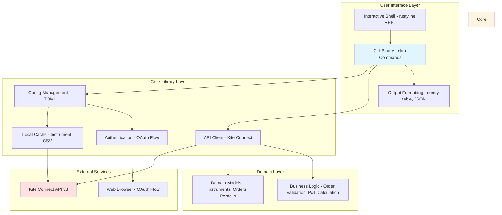
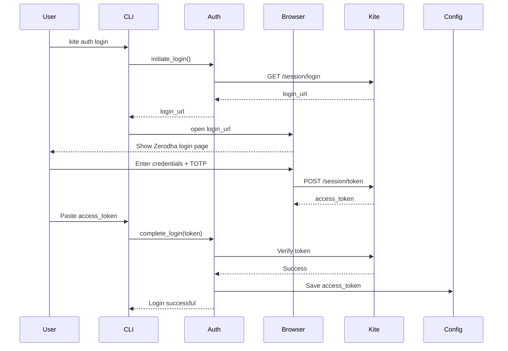
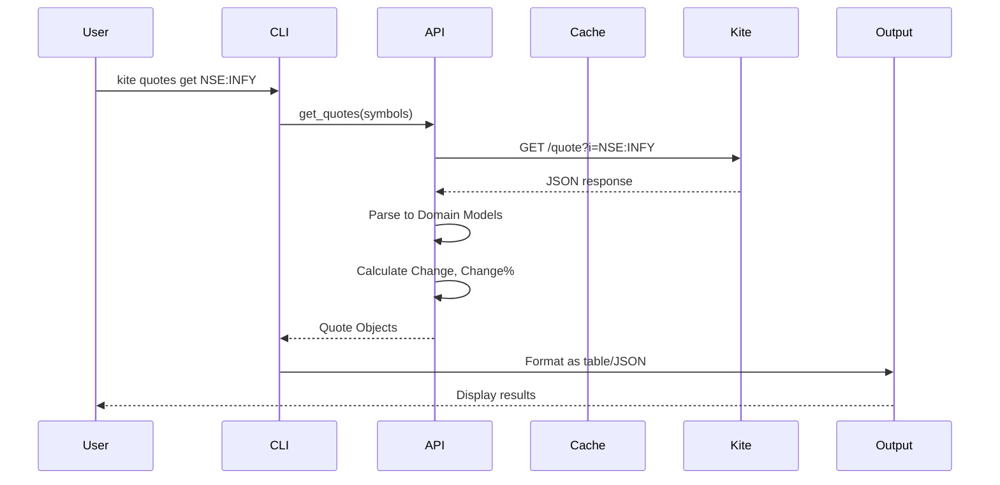
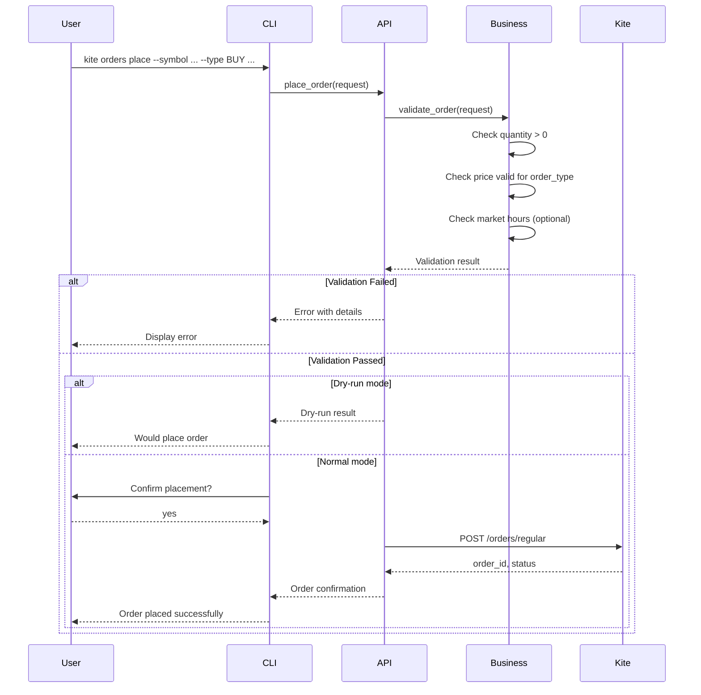
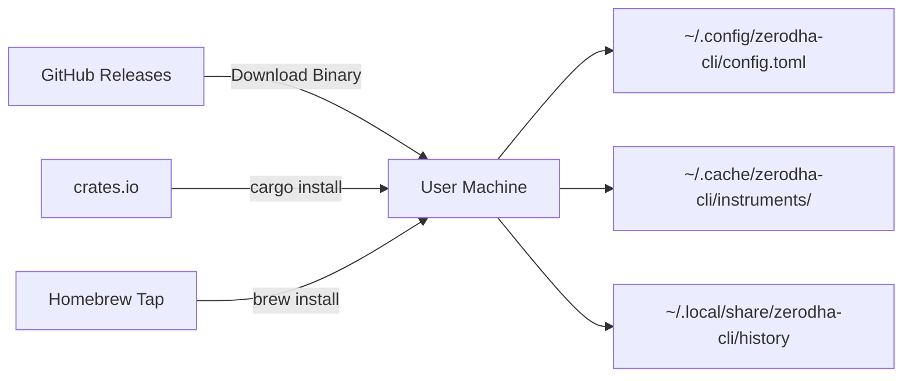

# Architecture — Zerodha CLI

**Project:** zerodha-cli  
**Version:** 1.0.0  
**Date:** 2026-02-25  
**Author:** ARES (Software Architect)

---

## 1. System Overview

### 1.1 Purpose

Zerodha CLI is a terminal-based trading tool that provides command-line access to Zerodha's Kite Connect API. It enables traders to interact with their brokerage accounts through a familiar CLI interface, supporting operations like authentication, order management, portfolio tracking, and market data retrieval.

### 1.2 Architecture Style

**Modular CLI Application** — A single binary distribution with internal modularization:
- **Core library** (`zerodha-cli-core`) — Business logic, API client, models, configuration
- **CLI binary** (`zerodha-cli`) — Command-line interface using clap
- **Shell module** — Interactive REPL mode using rustyline

### 1.3 Design Principles

1. **Single Binary Distribution** — Zero dependencies on system beyond standard Rust runtime
2. **Performance-First** — Async I/O for all HTTP operations using tokio
3. **Type Safety** — Leverage Rust's type system for API correctness
4. **Ergonomic UX** — Familiar CLI patterns (subcommands, flags, interactive shell)
5. **Extensibility** — Module boundaries enable future features (WebSocket streaming, automated trading)
6. **Cross-Platform** — Works on macOS, Linux, and Windows

---

## 2. Component Architecture



### 2.1 Component Descriptions

| Component | Responsibility | Technology |
|-----------|----------------|------------|
| **CLI Binary** | Command parsing, subcommand routing, error handling | clap, anyhow |
| **Interactive Shell** | REPL mode with history and tab completion | rustyline |
| **Config Management** | Load/save TOML config, manage API credentials | dirs, toml |
| **Local Cache** | Store instrument CSV, avoid repeated downloads | std fs, chrono |
| **API Client** | HTTP client for Kite Connect API, rate limiting | reqwest, tokio |
| **Authentication** | OAuth flow, token management, auto-refresh | webbrowser |
| **Domain Models** | Structs representing API entities | serde |
| **Business Logic** | Order validation, P&L calculations, conversions | Pure Rust |

---

## 3. Data Flow

### 3.1 Authentication Flow



### 3.2 Quote Retrieval Flow



### 3.3 Order Placement Flow



---

## 4. Technology Stack

| Layer | Technology | Rationale |
|-------|-----------|-----------|
| **Language** | Rust 1.80+ | Performance, memory safety, single binary distribution |
| **CLI Framework** | clap 4.5 | Modern derive-based parsing, subcommand support, excellent docs |
| **Async Runtime** | tokio 1.38 | Industry-standard async I/O, mature ecosystem |
| **HTTP Client** | reqwest 0.12 | Async, TLS support, JSON handling, connection pooling |
| **Serialization** | serde 1.0 + serde_json | De/serialization, compile-time type safety |
| **Config Format** | toml 0.8 | Human-readable, standard for CLI tools |
| **Config Path** | dirs 5.0 | Cross-platform config directory (XDG compliant) |
| **Output Tables** | comfy-table 7.1 | Pretty table formatting, auto-fit, styling |
| **Interactive Shell** | rustyline 14.0 | REPL with history, completion, key bindings |
| **Date/Time** | chrono 0.4 | Date parsing, timezone handling, token expiry |
| **Web Browser** | webbrowser 1.0 | Open OAuth login URL in system browser |
| **Error Handling** | anyhow 1.0 + thiserror | Ergonomic error handling, context preservation |
| **Logging** | tracing 0.1 + tracing-subscriber | Structured logging, async-aware |
| **Testing** | rstest | Parameterized tests, fixtures |
| **CSV Parsing** | csv 1.3 | Efficient CSV parsing for instrument cache |

---

## 5. Architecture Decision Records (ADRs)

### ADR-001: Rust as Language for CLI Tool

**Status:** Accepted

**Context:**
- CLI tool needs high performance for API calls and data processing
- Single binary distribution required (no runtime dependencies)
- Target users prefer terminal-based workflows
- Tool will handle financial data (correctness critical)

**Options Considered:**
| Option | Pros | Cons |
|--------|------|------|
| **Rust** | Performance, memory safety, single binary, strong typing | Steeper learning curve for new contributors |
| **Go** | Single binary, fast compilation, simple async | No generics, more verbose error handling |
| **Node.js** | Large ecosystem, fast prototyping | Requires Node runtime, larger distribution |
| **Python** | Easy to learn, rich ecosystem | Requires Python runtime, slower performance |

**Decision:** Choose **Rust** for performance, safety, and single binary distribution.

**Consequences:**
- ✅ Fast startup (< 100ms), low memory footprint
- ✅ Binary size < 10MB with optimizations
- ✅ Type-safe API interactions (compile-time guarantees)
- ✅ Cross-platform: macOS, Linux, Windows
- ⚠️ Learning curve for Rust for maintenance
- ⚠️ Longer compile times than Go

---

### ADR-002: clap for CLI Framework

**Status:** Accepted

**Context:**
- Need modern, derive-based CLI argument parsing
- Subcommands for different functional areas (auth, orders, quotes, etc.)
- Help generation and documentation required

**Options Considered:**
| Option | Pros | Cons |
|--------|------|------|
| **clap (derive)** | Type-safe, derive macros, excellent docs | Verbose for complex nested commands |
| **clap (builder)** | Fine-grained control, dynamic generation | More boilerplate than derive |
| **pico-args** | Minimal, zero dependencies | No subcommands, no help generation |

**Decision:** Choose **clap with derive macros** for type-safe, maintainable command definitions.

**Consequences:**
- ✅ Compile-time checking of CLI arguments
- ✅ Auto-generated `--help` documentation
- ✅ Support for subcommands, flags, positional args
- ✅ Easy to add new commands via derive macros

---

### ADR-003: reqwest + tokio for HTTP Client

**Status:** Accepted

**Context:**
- All operations interact with Kite Connect API over HTTPS
- Need rate limiting (3 req/sec hard limit from Kite)
- Async I/O for performance (multiple concurrent requests)

**Options Considered:**
| Option | Pros | Cons |
|--------|------|------|
| **reqwest + tokio** | Mature, async, TLS, connection pooling | tokio runtime required |
| **surf** | Middleware-based, async | Less mature ecosystem |
| **ureq** | Simple, sync API | Blocking, slower for concurrent requests |

**Decision:** Choose **reqwest with tokio** for async HTTP client with connection pooling.

**Consequences:**
- ✅ Non-blocking I/O for fast API calls
- ✅ Built-in connection pooling and TLS
- ✅ Async/await ergonomics
- ✅ Rate limiting can be implemented via tokio channels

---

### ADR-004: TOML for Configuration

**Status:** Accepted

**Context:**
- Need to store API credentials (api_key, api_secret, access_token)
- Configuration needs to be human-readable and editable
- Cross-platform config directory location

**Options Considered:**
| Option | Pros | Cons |
|--------|------|------|
| **TOML** | Simple, readable, standard for Rust tools | Limited data types |
| **JSON** | Universal, parsers everywhere | Verbose, not human-friendly |
| **YAML** | Rich features, human-readable | More complex, edge cases |

**Decision:** Choose **TOML** for config file format.

**Consequences:**
- ✅ Human-readable and editable
- ✅ Standard in Rust ecosystem (`serde_derive` support)
- ✅ Simple types suffice (strings, numbers, booleans)

---

### ADR-005: No Database (Local File Storage)

**Status:** Accepted

**Context:**
- CLI tool needs to store configuration and instrument cache
- No multi-user requirements
- No complex queries or relationships
- Single account per config

**Options Considered:**
| Option | Pros | Cons |
|--------|------|------|
| **Local Files (TOML + CSV)** | Zero dependencies, simple, portable | No transactions, no ACID |
| **SQLite** | Transactions, ACID, queries | Extra dependency, overkill |

**Decision:** Choose **local file storage** (TOML for config, CSV for instrument cache).

**Consequences:**
- ✅ Zero external dependencies
- ✅ Simple backup and migration
- ✅ Config can be manually edited
- ⚠️ No transactional guarantees (acceptable for single-user CLI)

---

### ADR-006: Interactive Shell Mode

**Status:** Accepted

**Context:**
- Power users prefer interactive REPL for frequent operations
- Tab completion reduces typing errors
- Command history for repeat operations

**Options Considered:**
| Option | Pros | Cons |
|--------|------|------|
| **rustyline** | readline-like, history, completion | Less features than GNU readline |
| **repl** | Simple REPL implementation | No history or completion |
| **No shell** | Simpler implementation | Poor UX for power users |

**Decision:** Choose **rustyline** for interactive REPL with history and completion.

**Consequences:**
- ✅ Familiar shell UX (Ctrl+R, arrow keys)
- ✅ Tab completion for commands and flags
- ✅ Persistent history across sessions
- ✅ Customizable prompt

---

### ADR-007: Modular Architecture (Core Library + CLI Binary)

**Status:** Accepted

**Context:**
- Want to separate business logic from presentation
- Enable testing of core library independently
- Future: could publish `zerodha-cli-core` as a library for other tools

**Options Considered:**
| Option | Pros | Cons |
|--------|------|------|
| **Modular (Core + CLI)** | Testable, publishable, clean boundaries | More complex workspace setup |
| **Monolithic binary** | Simple structure, faster compile | Harder to test core logic |

**Decision:** Choose **modular architecture** with `zerodha-cli-core` library + `zerodha-cli` binary.

**Consequences:**
- ✅ Core library can be unit tested without CLI framework
- ✅ Clean separation: CLI only handles I/O, core has business logic
- ✅ Potential for library publication in future
- ✅ Integration tests easier (mock API client)
- ⚠️ Slightly more complex Cargo workspace

---

### ADR-008: Project Structure for CLI Tools (No Backend/Client Monorepo)

**Status:** Accepted

**Context:**
- SDLC workflow guidelines mandate monorepo structure with `backend/` and `client/` folders
- This project is a CLI tool, not a web application with server-client architecture
- The backend/client pattern is designed for web apps with separate server and web frontend
- CLI tools have different architectural needs: single binary distribution, no web UI

**Options Considered:**
| Option | Pros | Cons |
|--------|------|------|
| **Workspace (cli/ + core/)** | Modular, testable, Rust best practice for larger CLI tools | More complex workspace setup |
| **Single crate (src/)** | Simpler structure | Less modular, harder to test core logic |
| **Backend/Client split** | Follows SDLC guideline convention | Confusing for CLI tool, no web UI |

**Decision:** Use **Rust workspace structure** with `cli/` (binary) and `core/` (library) crates. This provides modularity while maintaining single binary distribution.

**Project Structure:**
```
zerodha-cli/
├── Cargo.toml          # Workspace root
├── cli/                # Binary crate (depends on core)
│   └── src/main.rs
├── core/               # Library crate with business logic
│   └── src/
│       ├── lib.rs
│       ├── api/        # Kite Connect API client
│       ├── auth/       # Authentication
│       ├── cli/        # CLI command definitions
│       ├── config/     # Configuration management
│       ├── models/     # Domain models
│       ├── output/     # Output formatting
│       └── ...
└── docs/               # Documentation
```

**Consequences:**
- ✅ Follows Rust workspace best practices for larger CLI tools
- ✅ Single binary distribution (key requirement)
- ✅ Clear separation: cli handles I/O, core library has business logic
- ✅ Library can be published to crates.io independently
- ✅ Testable: core library unit tests don't require CLI framework
- ❌ Deviates from backend/client monorepo convention (documented here as ADR)
- ⚠️ May need explanation for SDLC workflow compliance

**Rationale for Deviation:**
The backend/client monorepo pattern is designed for:
- Web applications with HTTP server backend
- Web/UI frontend running in browser
- Separate deployment units

CLI tools are fundamentally different:
- Single compiled binary (no separate deployment units)
- Terminal-based UI (no web frontend)
- Direct execution on user's machine
- Distribution via binary packages or crates.io

---

## 6. Security Architecture

### 6.1 Credential Storage

| Aspect | Implementation |
|--------|----------------|
| **Config Location** | `~/.config/zerodha-cli/config.toml` (XDG compliant) |
| **File Permissions** | `0600` (owner read/write only) on Unix systems |
| **Environment Variables** | Support for `ZERODHA_API_KEY`, `ZERODHA_API_SECRET` |
| **Token Storage** | `access_token` stored in TOML, never logged |
| **Secret Masking** | All logs redact `access_token` and `api_secret` |

### 6.2 Network Security

| Aspect | Implementation |
|--------|----------------|
| **TLS** | All HTTP connections use TLS 1.2+ (reqwest default) |
| **Certificate Validation** | Default system certificate store |
| **API Endpoint** | Hardcoded to `https://kite.zerodha.com` |
| **Rate Limiting** | Enforce 3 req/sec (Kite Connect hard limit) |

### 6.3 Input Validation

| Aspect | Implementation |
|--------|----------------|
| **Order Validation** | Quantity > 0, price valid for order_type, symbol format |
| **Symbol Format** | `EXCHANGE:SYMBOL` (e.g., `NSE:INFY`) |
| **Dry-Run Mode** | All destructive commands require confirmation or `--dry-run` flag |

---

## 7. Deployment Architecture

### 7.1 Distribution Model



### 7.2 Distribution Channels

| Channel | Target | Command |
|---------|--------|---------|
| **Binary** | All platforms | Download from GitHub Releases |
| **Cargo** | Rust developers | `cargo install zerodha-cli` |
| **Homebrew** | macOS | `brew install zerodha-cli/tap/zerodha-cli` |
| **APT/DEB** | Debian/Ubuntu | Download .deb package |
| **RPM** | Fedora/RHEL | Download .rpm package |

### 7.3 Directory Structure

```
~/.config/zerodha-cli/          # Configuration directory
└── config.toml                 # API credentials, defaults

~/.cache/zerodha-cli/           # Cache directory
└── instruments/
    ├── NSE_2024-02-25.csv      # Cached NSE instruments
    ├── BSE_2024-02-25.csv      # Cached BSE instruments
    └── NFO_2024-02-25.csv      # Cached NFO instruments

~/.local/share/zerodha-cli/     # Data directory
└── history                     # Shell history (1000 lines max)
```

---

## 8. Performance Architecture

### 8.1 Performance Targets

| Metric | Target | Implementation |
|--------|--------|----------------|
| **Startup Time** | < 100ms | Lazy config loading, minimal initialization |
| **API Response** | < 500ms (95th) | Connection pooling, async I/O |
| **Binary Size** | < 10MB | LTO optimizations, strip symbols |
| **Memory Footprint** | < 50MB | Efficient data structures, no leaks |

### 8.2 Caching Strategy

| Data Type | Cache Location | TTL | Refresh Strategy |
|-----------|----------------|-----|------------------|
| **Instruments** | CSV files | 24 hours | `--refresh` flag or auto-expiry |
| **Quotes** | In-memory | 1 minute | Per-command (no persistent cache) |
| **Holdings/Positions** | API only | N/A | Always fetch fresh data |

### 8.3 Rate Limiting

```rust
// Token bucket rate limiter: 3 req/sec (Kite Connect hard limit)
use governor::{Quota, RateLimiter};

let limiter = RateLimiter::direct(Quota::per_second(3));
```

---

## 9. Error Handling Strategy

### 9.1 Error Categories

| Category | Example | User Action |
|----------|---------|-------------|
| **Network Error** | Connection timeout | Retry or check internet |
| **Auth Error** | Invalid access token | Run `kite auth login` |
| **API Error** | Symbol not found | Verify symbol format |
| **Validation Error** | Invalid quantity | Check order parameters |
| **Rate Limit** | Too many requests | Wait and retry |

### 9.2 Error Response Format

```bash
$ kite quotes get INVALID:SYMBOL
Error: Failed to fetch quotes: Symbol not found (status: 400)
Suggestion: Verify symbol format (e.g., NSE:INFY). Use `kite instruments search` to find valid symbols.
```

---

## 10. Testing Strategy

### 10.1 Test Layers

| Layer | Tools | Coverage |
|-------|-------|----------|
| **Unit Tests** | rstest | Core library (config, models, validation) |
| **Integration Tests** | mockito | API client with mocked responses |
| **E2E Tests** | CliTest (custom) | CLI commands with test config |
| **Manual QA** | Human testing | Real Kite Connect sandbox |

### 10.2 Test Coverage Targets

| Module | Target | Rationale |
|--------|--------|-----------|
| **Config** | 90% | Critical for credentials |
| **API Client** | 85% | Network logic |
| **Validation** | 95% | Financial correctness |
| **CLI Parsing** | 80% | Command correctness |
| **Overall** | 70%+ | Requirement NFR-015 |

---

## 11. Future Extensibility

### 11.1 Potential Enhancements

| Feature | Phase | Impact |
|---------|-------|--------|
| **WebSocket Streaming** | Phase 5 | Real-time quotes, order updates |
| **Historical Data API** | Phase 5 | Backtesting, analytics |
| **Automated Trading** | Future | Scriptable order placement |
| **Multi-Account Support** | Future | Portfolio aggregation |
| **Paper Trading Mode** | Future | Risk-free testing |
| **Mobile Companion** | Future | Push notifications |

### 11.2 Extension Points

| Module | Extension Point |
|--------|-----------------|
| **API Client** | Add new Kite Connect endpoints |
| **Commands** | Add new subcommands via clap derive |
| **Output** | Add new output formats (CSV, HTML) |
| **Validation** | Add new order types, products |

---

## 12. Architecture Summary

Zerodha CLI is a **modular, performance-first Rust application** designed for terminal-based trading interactions. Key architectural decisions:

1. **Rust for performance and safety** — Single binary distribution with compile-time guarantees
2. **Modular design** — Separated core library and CLI binary for testability
3. **Async I/O** — tokio + reqwest for non-blocking HTTP operations
4. **No external dependencies** — Local file storage (TOML + CSV)
5. **Ergonomic UX** — clap for CLI, rustyline for interactive shell
6. **Security-first** — Credential masking, TLS, validation, dry-run mode
7. **Cross-platform** — Works on macOS, Linux, Windows

This architecture balances simplicity (single binary, no DB) with extensibility (modular boundaries, clean separation of concerns) to serve the target users: traders who prefer terminal-based workflows.

---

**End of Architecture Document**
