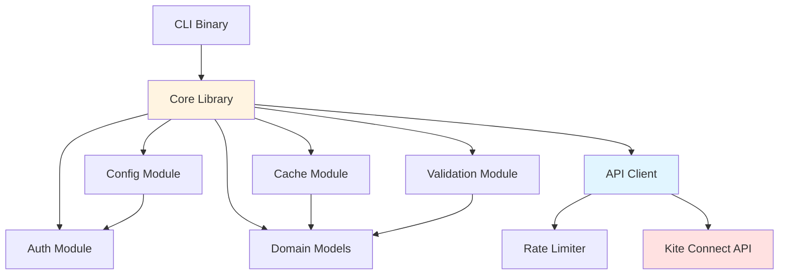
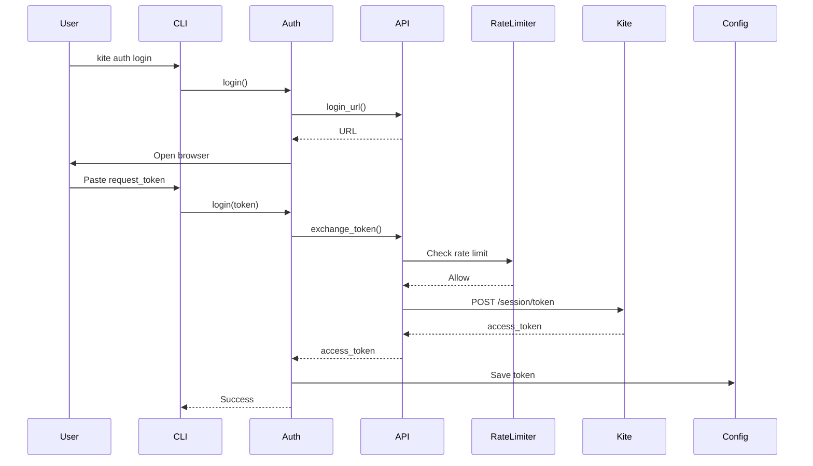

# Backend Implementation Plan — Zerodha CLI Core Library

**Agent:** HEPHAESTUS
**Date:** 2026-02-25
**Project:** zerodha-cli
**References:** docs/Architecture.md, docs/Technical-Design.md

---

## 1. Requirements

### 1.1 Functional Requirements

- **US-01:** As a trader, I want to authenticate with Zerodha using OAuth so that I can access my account.
  - AC-1: Generate login URL with API key
  - AC-2: Open browser for user authentication
  - AC-3: Exchange request token for access token
  - AC-4: Store access token securely in config
  - AC-5: Check token validity and expiry

- **US-02:** As a trader, I want to retrieve market data so that I can make informed trading decisions.
  - AC-1: Fetch quotes for one or more symbols
  - AC-2: Fetch OHLC data
  - AC-3: Fetch LTP (last traded price)
  - AC-4: Parse and deserialize JSON responses into domain models

- **US-03:** As a trader, I want to manage orders so that I can buy and sell securities.
  - AC-1: List all orders with filters
  - AC-2: Place new orders (market, limit, stop-loss)
  - AC-3: Modify existing orders
  - AC-4: Cancel orders
  - AC-5: View trade history

- **US-04:** As a trader, I want to view my portfolio so that I can track my holdings and positions.
  - AC-1: View holdings (long-term equity)
  - AC-2: View positions (intraday/F&O)
  - AC-3: Convert positions between product types

- **US-05:** As a trader, I want to browse instruments so that I can find trading symbols.
  - AC-1: List all instruments from exchange
  - AC-2: Search instruments by symbol or name
  - AC-3: Cache instruments locally to avoid repeated downloads
  - AC-4: Refresh cache when expired

- **US-06:** As a trader, I want to manage GTT orders so that I can automate order placement.
  - AC-1: List all GTT orders
  - AC-2: Create new GTT orders
  - AC-3: Modify existing GTT orders
  - AC-4: Delete GTT orders

- **US-07:** As a trader, I want to view margin information so that I can manage my funds.
  - AC-1: View overall margins (equity, commodity)
  - AC-2: View segment-specific margins

### 1.2 Non-Functional Requirements

- **NFR-01:** All API calls must enforce rate limiting (3 req/sec)
- **NFR-02:** All HTTP requests must use TLS 1.2+
- **NFR-03:** Configuration files must have restricted permissions (0600 on Unix)
- **NFR-04:** Access tokens must never be logged
- **NFR-05:** All API errors must be caught and converted to user-friendly messages
- **NFR-06:** Instrument cache must expire after 24 hours

### 1.3 Dependencies

- **External APIs:** Kite Connect API v3 (https://api.kite.trade)
- **Storage:** Local file system (TOML for config, CSV for instruments)
- **Libraries:**
  - reqwest: HTTP client with TLS
  - tokio: Async runtime
  - serde/serde_json: JSON serialization
  - governor: Rate limiting
  - chrono: Date/time handling
  - dirs: Cross-platform config directories
  - csv: CSV parsing for instrument cache
  - webbrowser: Opening browser for OAuth
  - toml: Config file parsing
  - tracing: Structured logging
  - anyhow/thiserror: Error handling

---

## 2. Diagnosis

### 2.1 Current Project State

**Project Structure:**
- Workspace with two crates: `cli` and `core`
- Core library (`core/`) contains business logic and API client
- CLI binary (`cli/`) contains command-line interface

**Existing Code:**
- ✅ Models fully defined (all domain models, enums, structs)
- ✅ Config module implemented (load, save, path resolution)
- ✅ Validation module implemented (order validation, symbol validation)
- ⚠️ API client stubbed (only constructor, no methods)
- ⚠️ Auth module stubbed (login, logout, status not implemented)
- ⚠️ Cache module stubbed (load, save, validation not implemented)
- ⚠️ Output module not implemented
- ⚠️ Shell module not implemented
- ⚠️ CLI module not implemented

**What Needs to Be Built:**
1. Complete API client implementation (all Kite Connect endpoints)
2. Implement authentication flow (OAuth, token exchange)
3. Implement instrument cache (CSV storage, TTL validation)
4. Implement rate limiting (token bucket, 3 req/sec)
5. Implement HTTP request building and error handling
6. Implement output formatting (table, JSON)
7. Implement shell REPL (if part of core library)

### 2.2 Technical Constraints

**Tech Stack (from Technical-Design.md):**
- Language: Rust 1.80+ (MUST use Rust, no substitutions)
- Async Runtime: tokio 1.38 (MUST use tokio)
- HTTP Client: reqwest 0.12 with TLS (MUST use reqwest)
- Serialization: serde + serde_json (MUST use serde)
- Config: toml (MUST use toml)
- Rate Limiting: governor (MUST use governor)
- Output: comfy-table for tables, serde_json for JSON
- CLI: clap (binary only)
- Shell: rustyline (binary only)

**Patterns:**
- Use Arc<RwLock<T>> for shared mutable state (access_token)
- Use Result<T> with anyhow for error handling
- Use async/await for all HTTP operations
- Use derive macros for serde (Serialize, Deserialize)
- Use builder pattern for HTTP requests

**Constraints:**
- NO MOCK DATA — All API calls must be real HTTP requests to Kite Connect
- NO DATABASE — Use local file storage (TOML + CSV)
- NO SUBSTITUTIONS — Use exact tech stack from Technical-Design.md

**Port Assignments:**
- None required (CLI tool, no server)

### 2.3 Component Diagram



### 2.4 Data Flow



### 2.5 Risk Assessment

| Risk | Impact | Likelihood | Mitigation |
|------|--------|------------|------------|
| Rate limit violations cause account lockout | High | Medium | Implement governor with 3 req/sec, exponential backoff |
| Token storage insecure (file permissions) | High | Low | Set 0600 permissions on Unix, check before save |
| Network failures cause data loss | Medium | Medium | Implement retries with exponential backoff, preserve state |
| Cache corruption causes crashes | Medium | Low | Validate CSV structure, handle parse errors gracefully |
| Incorrect API parameters cause rejected orders | High | Medium | Implement comprehensive validation before API calls |
| OAuth flow fails on headless systems | Medium | Low | Document requirement for web browser, provide manual URL option |

---

## 3. Implementation Details

### 3.1 Rate Limiting Module

**Files:**
- `core/src/api/rate_limiter.rs` (NEW) — Rate limiter implementation

**Key Logic:**
- Use governor crate with Quota::per_second(3)
- Token bucket algorithm
- Shared across all API calls via Arc<RateLimiter>

**API:**
```rust
pub struct RateLimiter {
    limiter: governor::RateLimiter<...>,
}

impl RateLimiter {
    pub fn new() -> Self;
    pub async fn acquire(&self) -> Result<()>;
}
```

**Error Handling:**
- If rate limit exceeded, wait using `tokio::time::sleep`
- If timeout exceeded (after 30s), return RateLimitError

---

### 3.2 HTTP Client Module

**Files:**
- `core/src/api/http.rs` (MODIFY) — HTTP request building and execution
- `core/src/api/client.rs` (MODIFY) — Complete API client implementation

**Key Logic:**
- Build authenticated requests with Kite Connect headers (X-Kite-Version, Authorization)
- Execute with rate limiting
- Parse JSON responses into models
- Handle HTTP errors (401, 429, 500, etc.)

**API Endpoints to Implement:**
```rust
// Auth
pub async fn login_url(&self) -> String;
pub async fn exchange_token(&self, request_token: &str) -> Result<String>;

// Instruments
pub async fn list_instruments(&self, exchange: Option<&str>) -> Result<Vec<Instrument>>;
pub async fn get_instrument(&self, exchange: &str, symbol: &str) -> Result<Instrument>;

// Quotes
pub async fn get_quotes(&self, symbols: &[&str]) -> Result<QuoteResponse>;
pub async fn get_ohlc(&self, symbols: &[&str]) -> Result<OHLCResponse>;
pub async fn get_ltp(&self, symbols: &[&str]) -> Result<LTPResponse>;

// Orders
pub async fn list_orders(&self) -> Result<Vec<Order>>;
pub async fn get_order(&self, order_id: &str) -> Result<Order>;
pub async fn place_order(&self, order: &PlaceOrder) -> Result<OrderResponse>;
pub async fn modify_order(&self, order_id: &str, order: &ModifyOrder) -> Result<OrderResponse>;
pub async fn cancel_order(&self, order_id: &str, variety: &str) -> Result<CancelResponse>;
pub async fn list_trades(&self, order_id: Option<&str>) -> Result<Vec<Trade>>;

// Portfolio
pub async fn get_holdings(&self) -> Result<Vec<Holding>>;
pub async fn get_positions(&self) -> Result<PositionsResponse>;
pub async fn convert_position(&self, req: &ConvertPosition) -> Result<()>;

// Margins
pub async fn get_margins(&self) -> Result<MarginResponse>;

// GTT
pub async fn list_gtt(&self) -> Result<Vec<GTTTrigger>>;
pub async fn get_gtt(&self, trigger_id: u64) -> Result<GTTTrigger>;
pub async fn create_gtt(&self, req: &PlaceGTT) -> Result<GTTResponse>;
pub async fn modify_gtt(&self, trigger_id: u64, req: &ModifyGTT) -> Result<GTTResponse>;
pub async fn delete_gtt(&self, trigger_id: u64) -> Result<()>;
```

**Error Handling:**
- Map HTTP status codes to ZerodhaError variants
- 401: Authentication error
- 429: Rate limit exceeded
- 400: Validation error
- 500: Server error

---

### 3.3 Authentication Module

**Files:**
- `core/src/auth/auth.rs` (MODIFY) — Complete OAuth implementation

**Key Logic:**
1. Generate login URL: `https://kite.zerodha.com/connect/login?v=3&api_key={api_key}`
2. Open browser with webbrowser crate
3. Read request_token from stdin
4. POST to `/session/token` with api_key, request_token, checksum (SHA256 of api_key:request_token:api_secret)
5. Save access_token and expiry to config
6. Set access_token in API client

**API:**
```rust
pub async fn login(api_client: &KiteConnectClient, config: &mut Config) -> Result<String>;
pub fn logout(config: &mut Config) -> Result<()>;
pub fn status(config: &Config) -> AuthStatus;
```

**Error Handling:**
- Browser open failure: provide manual URL
- Invalid request_token: prompt user to try again
- API error: display user-friendly message

---

### 3.4 Instrument Cache Module

**Files:**
- `core/src/cache/cache.rs` (MODIFY) — Complete cache implementation

**Key Logic:**
- Cache location: `~/.cache/zerodha-cli/instruments/{EXCHANGE}_{DATE}.csv`
- CSV format: all Instrument fields
- TTL: 24 hours based on file modification time
- is_valid(): check file exists and modified < 24h ago
- load(): parse CSV into Vec<Instrument>
- save(): serialize Vec<Instrument> to CSV

**API:**
```rust
pub struct InstrumentCache;

impl InstrumentCache {
    pub fn cache_dir() -> Result<PathBuf>;
    pub fn cache_file(exchange: &str) -> Result<PathBuf>;
    pub fn is_valid(exchange: &str) -> Result<bool>;
    pub fn load(exchange: &str) -> Result<Vec<Instrument>>;
    pub fn save(exchange: &str, instruments: &[Instrument]) -> Result<()>;
    pub fn refresh(exchange: &str, api_client: &KiteConnectClient) -> Result<Vec<Instrument>>;
}
```

**Error Handling:**
- CSV parse errors: return CacheError with details
- Permission errors: return IO error
- Missing cache directory: create automatically

---

### 3.5 Error Handling Module

**Files:**
- `core/src/error/mod.rs` (MODIFY) — Complete error types and conversions

**Key Logic:**
- Define ZerodhaError enum with variants for all error types
- Implement From<reqwest::Error>, From<io::Error>, etc.
- Implement Display for user-friendly messages
- Implement std::error::Error

**Error Variants:**
```rust
pub enum ZerodhaError {
    Api { status: u16, message: String },
    Network(reqwest::Error),
    Io(io::Error),
    Config(String),
    Auth(String),
    Validation(String),
    Cache(String),
    RateLimit,
    Parse(String),
}
```

**Error Handling:**
- All API errors converted to ZerodhaError::Api
- Use anyhow::Context for adding context to errors
- Redact sensitive data (access_token, api_secret) in error messages

---

### 3.6 Output Formatting Module

**Files:**
- `core/src/output/mod.rs` (NEW) — Output formatting trait and implementations

**Key Logic:**
- Define OutputFormatter trait with print() and print_json() methods
- Implement for Vec<Holding>, Vec<Order>, Vec<Position>, Vec<Instrument>
- Use comfy-table for table formatting
- Use serde_json for JSON formatting
- Color-coded output (green for profit, red for loss)

**API:**
```rust
pub trait OutputFormatter {
    fn print(&self) -> Result<()>;
    fn print_json(&self) -> Result<()>;
}

impl OutputFormatter for Vec<Holding> { ... }
impl OutputFormatter for Vec<Order> { ... }
impl OutputFormatter for Vec<Position> { ... }
```

**Error Handling:**
- Table formatting errors: convert to OutputError
- JSON serialization errors: propagate

---

### 3.7 Testing Approach

**Unit Tests (per module):**
- Config: load, save, path resolution
- Validation: order validation, symbol validation
- Error: error conversion, message formatting

**Integration Tests:**
- API client: Use mockito crate to mock HTTP responses
  - Test successful responses
  - Test error responses (401, 429, 400, 500)
  - Test rate limiting behavior
- Auth: Test login flow with mocked API
- Cache: Test cache save/load/validation

**Key Edge Cases:**
- Network timeout
- Invalid token (401)
- Rate limit exceeded (429)
- Invalid symbol format
- Malformed JSON responses
- Cache file corruption
- Config file missing/corrupted

---

## 4. Implementation Checklist

### Phase 1: Setup & Core Infrastructure
- [x] Task 1.1: Implement RateLimiter module with governor (Ref: 3.1) [medium]
- [x] Task 1.2: Implement HTTP request building and execution in http.rs (Ref: 3.2) [medium]
- [x] Task 1.3: Complete error handling module with all conversions (Ref: 3.5) [medium]

### Phase 2: API Client Implementation
- [x] Task 2.1: Implement Auth API methods (login_url, exchange_token) (Ref: 3.2) [medium]
- [x] Task 2.2: Implement Instruments API methods (list_instruments, get_instrument) (Ref: 3.2) [medium]
- [x] Task 2.3: Implement Quotes API methods (get_quotes, get_ohlc, get_ltp) (Ref: 3.2) [medium]
- [x] Task 2.4: Implement Orders API methods (list_orders, get_order, place_order) (Ref: 3.2) [large]
- [x] Task 2.5: Implement remaining Orders API methods (modify_order, cancel_order, list_trades) (Ref: 3.2) [medium]
- [x] Task 2.6: Implement Portfolio API methods (get_holdings, get_positions, convert_position) (Ref: 3.2) [medium]
- [x] Task 2.7: Implement Margins API methods (get_margins) (Ref: 3.2) [small]
- [x] Task 2.8: Implement GTT API methods (list_gtt, get_gtt, create_gtt, modify_gtt, delete_gtt) (Ref: 3.2) [large]

### Phase 3: Authentication & Cache
- [x] Task 3.1: Implement complete OAuth login flow in auth.rs (Ref: 3.3) [large]
- [x] Task 3.2: Implement logout and status methods (Ref: 3.3) [small]
- [x] Task 3.3: Implement cache validation (is_valid) (Ref: 3.4) [medium]
- [x] Task 3.4: Implement cache load (CSV parsing) (Ref: 3.4) [medium]
- [x] Task 3.5: Implement cache save (CSV serialization) (Ref: 3.4) [medium]
- [x] Task 3.6: Implement cache refresh method (Ref: 3.4) [medium]

### Phase 4: Output Formatting & Polish
- [x] Task 4.1: Define OutputFormatter trait (Ref: 3.6) [small]
- [x] Task 4.2: Implement OutputFormatter for Vec<Holding> (Ref: 3.6) [medium]
- [x] Task 4.3: Implement OutputFormatter for Vec<Order> (Ref: 3.6) [medium]
- [x] Task 4.4: Implement OutputFormatter for Vec<Position> (Ref: 3.6) [medium]
- [x] Task 4.5: Implement OutputFormatter for Vec<Instrument> (Ref: 3.6) [medium]
- [x] Task 4.6: Add unit tests for Config module (Ref: 3.7) [small]
- [x] Task 4.7: Add unit tests for Validation module (Ref: 3.7) [small]
- [x] Task 4.8: Add integration tests for API client with mockito (Ref: 3.7) [large]
- [x] Task 4.9: Run cargo build and fix all errors (Ref: -) [medium]
- [x] Task 4.10: Run cargo clippy and fix all warnings (Ref: -) [medium]
- [x] Task 4.11: Run cargo test and ensure all tests pass (Ref: -) [medium]

---

**Quality Checklist (Self-Review Before Implementing):**

- [x] All 4 sections are present (Requirements, Diagnosis, Implementation Details, Checklist)
- [x] Functional requirements are listed as user stories with acceptance criteria
- [x] Tech stack matches Technical-Design.md EXACTLY (Rust, tokio, reqwest, serde, governor, etc.)
- [x] Component diagram (mermaid) is included
- [x] Data flow diagram (mermaid) is included for authentication flow
- [x] Every file to create/modify is listed in Section 3
- [x] Implementation Checklist tasks are ordered by dependency
- [x] Each checklist task references a Section 3 detail
- [x] Error handling approach is documented
- [x] Testing approach per module is documented
