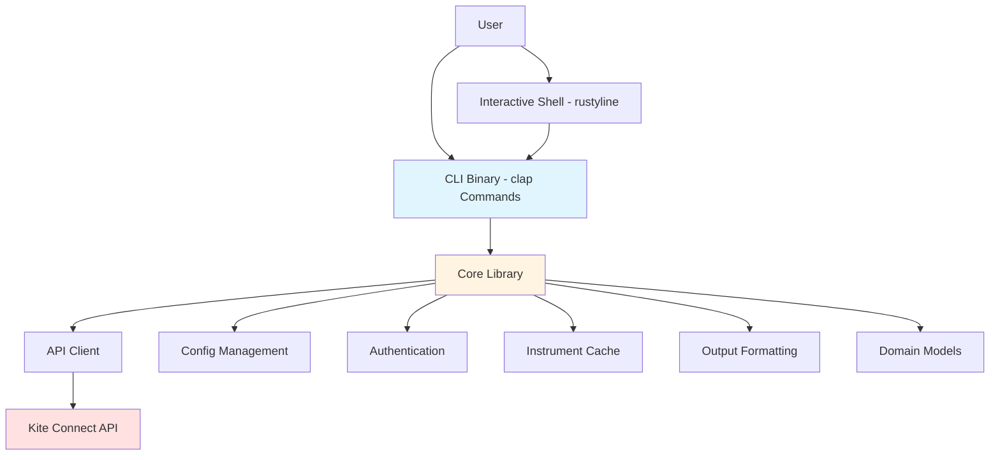
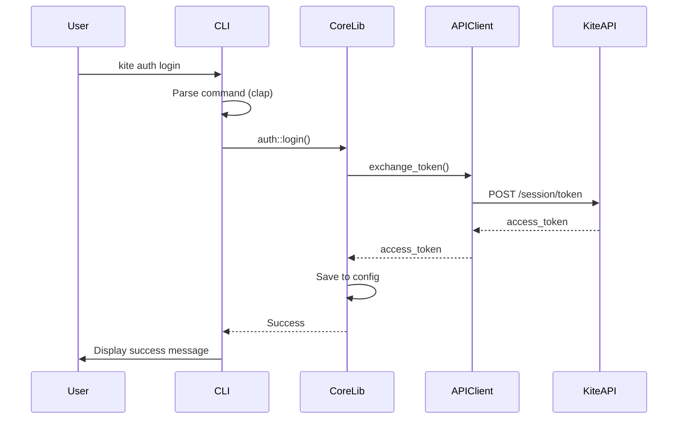

# Frontend Implementation Plan — Zerodha CLI

**Agent:** APHRODITE
**Date:** 2026-02-25
**Project:** zerodha-cli
**References:** docs/Architecture.md, docs/Technical-Design.md, docs/Backend-Plan.md

---

## 1. Requirements

### 1.1 Functional Requirements

- **US-01:** As a trader, I want to authenticate with Zerodha using the CLI so that I can access my account.
  - AC-1: `kite auth login` initiates OAuth flow with browser
  - AC-2: `kite auth status` shows current authentication state
  - AC-3: `kite auth logout` clears stored credentials
  - AC-4: `kite auth setup --api-key XXX --api-secret XXX` configures API credentials
  - AC-5: Access token is stored in config file after successful login

- **US-02:** As a trader, I want to browse instruments so that I can find trading symbols.
  - AC-1: `kite instruments list --exchange NSE` displays instruments in table format
  - AC-2: `kite instruments search "INFY"` finds instruments by symbol/name
  - AC-3: `kite instruments get NSE:INFY` shows detailed instrument information
  - AC-4: Instrument data is cached locally and refreshed with `--refresh` flag

- **US-03:** As a trader, I want to view market quotes so that I can make informed decisions.
  - AC-1: `kite quotes get NSE:INFY` shows full quote with OHLC and depth
  - AC-2: `kite quotes ohlc NSE:INFY` shows only OHLC data
  - AC-3: `kite quotes ltp NSE:INFY` shows only last traded price
  - AC-4: All commands support `--output json` for scripting

- **US-04:** As a trader, I want to manage orders so that I can buy and sell securities.
  - AC-1: `kite orders list` shows all orders with status filtering
  - AC-2: `kite orders place --symbol NSE:INFY --type BUY ...` places limit orders
  - AC-3: `kite orders market --symbol NSE:INFY --type BUY ...` places market orders
  - AC-4: `kite orders modify <order_id>` modifies existing orders
  - AC-5: `kite orders cancel <order_id>` cancels specific orders
  - AC-6: `kite orders cancel-all` cancels all open orders
  - AC-7: `kite orders trades` shows trade history
  - AC-8: Confirmation prompts before placing/canceling orders

- **US-05:** As a trader, I want to view my portfolio so that I can track holdings and positions.
  - AC-1: `kite portfolio holdings` shows long-term equity holdings with P&L
  - AC-2: `kite portfolio positions --net` shows net positions
  - AC-3: `kite portfolio positions --day` shows day positions
  - AC-4: P&L is color-coded (green for profit, red for loss)

- **US-06:** As a trader, I want to view margins so that I can manage my funds.
  - AC-1: `kite margins list` shows all margin segments
  - AC-2: `kite margins equity` shows equity margins only
  - AC-3: `kite margins commodity` shows commodity margins only

- **US-07:** As a trader, I want to manage GTT orders so that I can automate order placement.
  - AC-1: `kite gtt list` shows all GTT orders
  - AC-2: `kite gtt create` creates new GTT orders
  - AC-3: `kite gtt modify <trigger_id>` modifies existing GTT
  - AC-4: `kite gtt delete <trigger_id>` deletes GTT orders

- **US-08:** As a trader, I want an interactive shell mode for efficient workflow.
  - AC-1: `kite shell` starts REPL with `kite>` prompt
  - AC-2: All CLI commands work in shell without `kite` prefix
  - AC-3: Command history with up/down arrows
  - AC-4: Tab completion for commands
  - AC-5: `exit`, `quit`, or Ctrl+D exits shell

### 1.2 Non-Functional Requirements

- **NFR-01:** All commands support `--output table` (default) and `--output json` formats
- **NFR-02:** Output tables auto-fit to terminal width
- **NFR-03:** P&L values are color-coded (green/red)
- **NFR-04:** All destructive commands require confirmation or `--dry-run` flag
- **NFR-05:** Error messages are human-readable with suggested actions
- **NFR-06:** Help documentation is complete with examples for all commands

### 1.3 Dependencies

- **Backend API:** All Kite Connect API endpoints implemented in `core/src/api/client.rs`
- **Core Library:** Domain models, config, auth, cache, validation from `zerodha-cli-core`
- **CLI Framework:** clap 4.5 for command parsing (MUST match Technical-Design.md Section B)
- **Output Formatting:** comfy-table 7.1 for tables, serde_json for JSON (MUST match Technical-Design.md Section B)
- **Interactive Shell:** rustyline 14.0 for REPL (MUST match Technical-Design.md Section B)
- **Async Runtime:** tokio 1.38 (inherited from core library)

---

## 2. Diagnosis

### 2.1 Current Project State

**Project Structure:**
- Workspace with two crates: `cli` (binary) and `core` (library)
- Core library (`core/`) has backend implementation complete (per Backend-Plan.md)
- CLI binary (`cli/`) has only stub implementation

**Existing Code in CLI:**
- `cli/src/main.rs` — Entry point, calls `cli::run()` from core library
- `core/src/cli/mod.rs` — Stub with `todo!()` for `run()` function

**Existing Code in Core (Backend):**
- ✅ API client fully implemented (all Kite Connect endpoints)
- ✅ Auth module implemented (OAuth, token exchange)
- ✅ Config module implemented (load, save, path resolution)
- ✅ Validation module implemented (order validation, symbol validation)
- ✅ Cache module implemented (CSV storage, TTL validation)
- ✅ Output module implemented (table formatting, JSON serialization)
- ✅ Models fully defined (all domain models, enums, structs)
- ✅ Error handling implemented (ZerodhaError with all variants)

**What Needs to Be Built:**
1. Complete CLI command definitions using clap derive macros
2. Implement command handlers for all command groups (auth, instruments, quotes, orders, portfolio, margins, gtt, status, shell)
3. Integrate with core library API client, config, auth modules
4. Implement output formatting (table/JSON) using core output module
5. Implement interactive shell using rustyline
6. Add global flags: `--output`, `--config`, `--verbose`, `--help`, `--version`

### 2.2 Technical Constraints

**Tech Stack (from Technical-Design.md Section B):**
- CLI Framework: **clap 4.5** with derive macros (MUST use clap, no substitutions)
- Output Tables: **comfy-table 7.1** (MUST use comfy-table)
- Output JSON: **serde_json** (MUST use serde_json)
- Interactive Shell: **rustyline 14.0** (MUST use rustyline)
- Async Runtime: **tokio 1.38** (inherited from core library)

**Patterns:**
- Use clap derive macros for type-safe command definitions
- Use async/await for all API calls (via core library)
- Use Result<T> with anyhow for error handling
- Use global flags for output format, config path, verbosity

**Constraints:**
- NO MOCK DATA — All commands must call real backend API via core library
- NO SUBSTITUTIONS — Use exact tech stack from Technical-Design.md Section B
- All output must go through core output module (OutputFormatter trait)

**Port Assignments:**
- None required (CLI tool, no server)

### 2.3 Component Diagram



### 2.4 Data Flow



### 2.5 Risk Assessment

| Risk | Impact | Likelihood | Mitigation |
|------|--------|------------|------------|
| Incorrect clap command definitions cause compile errors | Medium | Low | Follow clap derive patterns, use Rust type system |
| Output formatting inconsistencies across commands | Medium | Medium | Use core OutputFormatter trait for all commands |
| Shell command parsing differs from main CLI | High | Medium | Re-use CLI parsing logic, strip 'kite' prefix in shell |
| Global flags not propagated to subcommands | Medium | Low | Use clap global flag support (`global = true`) |
| Async/await errors in command handlers | Medium | Medium | All command handlers must be async, use tokio main |
| Real API calls cause errors in development (no test data) | Low | Medium | Use `--dry-run` flag for destructive commands during testing |

---

## 3. Implementation Details

### 3.1 CLI Command Definitions (clap Derive)

**Files:**
- `cli/src/main.rs` (MODIFY) — Main entry point with clap Parser derive
- `cli/src/commands/mod.rs` (NEW) — Command enum definitions and handler routing
- `cli/src/commands/auth.rs` (NEW) — Auth command handlers
- `cli/src/commands/instruments.rs` (NEW) — Instruments command handlers
- `cli/src/commands/quotes.rs` (NEW) — Quotes command handlers
- `cli/src/commands/orders.rs` (NEW) — Orders command handlers
- `cli/src/commands/portfolio.rs` (NEW) — Portfolio command handlers
- `cli/src/commands/margins.rs` (NEW) — Margins command handlers
- `cli/src/commands/gtt.rs` (NEW) — GTT command handlers
- `cli/src/commands/status.rs` (NEW) — Status command handler
- `cli/src/commands/shell.rs` (NEW) — Shell command handler

**Key Logic:**
- Use clap derive macros for type-safe command parsing
- Define Commands enum with Subcommand derive
- Each command group has its own struct with derive
- Global flags: `--output`, `--config`, `--verbose` with `global = true`
- Use `#[command(subcommand)]` for nested command structure

**API:**
```rust
use clap::{Parser, Subcommand};

#[derive(Parser)]
#[command(name = "kite")]
#[command(about = "Zerodha Kite Connect CLI", long_about = None)]
#[command(version = "1.0.0")]
pub struct Cli {
    /// Output format (table, json)
    #[arg(short, long, global = true, default_value = "table")]
    pub output: String,

    /// Config file path
    #[arg(short, long, global = true)]
    pub config: Option<String>,

    /// Verbose output
    #[arg(short, long, global = true)]
    pub verbose: bool,

    #[command(subcommand)]
    pub command: Commands,
}

#[derive(Subcommand)]
pub enum Commands {
    Auth(AuthCommands),
    Instruments(InstrumentsCommands),
    Quotes(QuotesCommands),
    Orders(OrdersCommands),
    Portfolio(PortfolioCommands),
    Margins(MarginsCommands),
    Gtt(GttCommands),
    Status,
    Shell,
}
```

**Error Handling:**
- Parse errors: clap displays user-friendly error message
- Command execution errors: anyhow::Result<T>, display error with context
- Use `context()` from anyhow to add context to errors

---

### 3.2 Auth Commands

**Files:**
- `cli/src/commands/auth.rs` (NEW)

**Key Logic:**
- `login`: Call `core::auth::login(api_client, config)` to initiate OAuth flow
- `status`: Call `core::auth::status(config)` and display result
- `logout`: Call `core::auth::logout(config)` and confirm
- `setup`: Save API key and secret to config file

**API:**
```rust
pub async fn run_auth_login(
    config: &mut Config,
    api_client: &KiteConnectClient,
) -> Result<()>;

pub fn run_auth_status(config: &Config) -> Result<()>;

pub fn run_auth_logout(config: &mut Config) -> Result<()>;

pub fn run_auth_setup(
    api_key: String,
    api_secret: String,
    config: &mut Config,
) -> Result<()>;
```

**Integration Points:**
- Use `core::auth::login()` from core library
- Use `core::auth::status()` from core library
- Use `core::auth::logout()` from core library
- Use `core::config::Config` for config management

**Error Handling:**
- OAuth flow errors: Display with suggestion to retry
- Config save errors: Display with suggestion to check file permissions
- API errors: Display with status code and message

---

### 3.3 Instruments Commands

**Files:**
- `cli/src/commands/instruments.rs` (NEW)

**Key Logic:**
- `list`: Call `core::api::list_instruments()`, use cache if valid, refresh if `--refresh` flag
- `search`: Call `core::api::search_instruments()` (or filter cached list)
- `get`: Call `core::api::get_instrument()` to fetch specific instrument

**API:**
```rust
pub async fn run_instruments_list(
    exchange: Option<String>,
    refresh: bool,
    output_format: &str,
    api_client: &KiteConnectClient,
) -> Result<()>;

pub async fn run_instruments_search(
    query: String,
    exchange: Option<String>,
    output_format: &str,
    api_client: &KiteConnectClient,
) -> Result<()>;

pub async fn run_instruments_get(
    symbol: String,
    output_format: &str,
    api_client: &KiteConnectClient,
) -> Result<()>;
```

**Integration Points:**
- Use `core::api::list_instruments()` from core library
- Use `core::cache::InstrumentCache` for caching
- Use `core::output::OutputFormatter` trait for table/JSON output

**Error Handling:**
- Exchange not found: Display list of valid exchanges
- Cache errors: Display with suggestion to use `--refresh`
- API errors: Display with status code and message

---

### 3.4 Quotes Commands

**Files:**
- `cli/src/commands/quotes.rs` (NEW)

**Key Logic:**
- `get`: Call `core::api::get_quotes()`, format full quote with OHLC and depth
- `ohlc`: Call `core::api::get_ohlc()`, format only OHLC data
- `ltp`: Call `core::api::get_ltp()`, format only last traded price

**API:**
```rust
pub async fn run_quotes_get(
    symbols: Vec<String>,
    output_format: &str,
    api_client: &KiteConnectClient,
) -> Result<()>;

pub async fn run_quotes_ohlc(
    symbols: Vec<String>,
    output_format: &str,
    api_client: &KiteConnectClient,
) -> Result<()>;

pub async fn run_quotes_ltp(
    symbols: Vec<String>,
    output_format: &str,
    api_client: &KiteConnectClient,
) -> Result<()>;
```

**Integration Points:**
- Use `core::api::get_quotes()` from core library
- Use `core::api::get_ohlc()` from core library
- Use `core::api::get_ltp()` from core library
- Use `core::output::OutputFormatter` trait for table/JSON output

**Error Handling:**
- Invalid symbol format: Display expected format (EXCHANGE:SYMBOL)
- Symbol not found: Display with suggestion to use `kite instruments search`
- API errors: Display with status code and message

---

### 3.5 Orders Commands

**Files:**
- `cli/src/commands/orders.rs` (NEW)

**Key Logic:**
- `list`: Call `core::api::list_orders()`, filter by status if provided
- `get`: Call `core::api::get_order()` to fetch specific order details
- `place`: Validate parameters, confirm with user (unless `--dry-run`), call `core::api::place_order()`
- `market`: Validate parameters, confirm with user (unless `--dry-run`), call market order API
- `modify`: Validate parameters, call `core::api::modify_order()`
- `cancel`: Confirm with user, call `core::api::cancel_order()`
- `cancel-all`: List open orders, confirm with user, cancel all
- `trades`: Call `core::api::list_trades()` to fetch trade history

**API:**
```rust
pub async fn run_orders_list(
    status: Option<String>,
    output_format: &str,
    api_client: &KiteConnectClient,
) -> Result<()>;

pub async fn run_orders_get(
    order_id: String,
    output_format: &str,
    api_client: &KiteConnectClient,
) -> Result<()>;

pub async fn run_orders_place(
    symbol: String,
    transaction_type: String,
    order_type_enum: Option<String>,
    quantity: i32,
    price: f64,
    product: Option<String>,
    validity: Option<String>,
    dry_run: bool,
    variety: String,
    config: &Config,
    api_client: &KiteConnectClient,
) -> Result<()>;

pub async fn run_orders_market(
    symbol: String,
    transaction_type: String,
    quantity: i32,
    product: Option<String>,
    dry_run: bool,
    config: &Config,
    api_client: &KiteConnectClient,
) -> Result<()>;

pub async fn run_orders_modify(
    order_id: String,
    price: Option<f64>,
    quantity: Option<i32>,
    trigger_price: Option<f64>,
    validity: Option<String>,
    disclosed_quantity: Option<i32>,
    api_client: &KiteConnectClient,
) -> Result<()>;

pub async fn run_orders_cancel(
    order_id: String,
    variety: String,
    api_client: &KiteConnectClient,
) -> Result<()>;

pub async fn run_orders_cancel_all(
    api_client: &KiteConnectClient,
) -> Result<()>;

pub async fn run_orders_trades(
    order_id: Option<String>,
    output_format: &str,
    api_client: &KiteConnectClient,
) -> Result<()>;
```

**Integration Points:**
- Use `core::api::list_orders()` from core library
- Use `core::api::get_order()` from core library
- Use `core::api::place_order()` from core library
- Use `core::api::modify_order()` from core library
- Use `core::api::cancel_order()` from core library
- Use `core::api::list_trades()` from core library
- Use `core::validation::validate_order()` for validation
- Use `core::validation::validate_symbol()` for symbol validation
- Use `core::output::OutputFormatter` trait for table/JSON output

**Error Handling:**
- Validation errors: Display with field-specific error message
- Order not found: Display with suggestion to check order ID
- Market closed: Display with suggestion to try during market hours
- API errors: Display with status code and message
- Confirmation prompts: `y` to proceed, `n` to cancel

---

### 3.6 Portfolio Commands

**Files:**
- `cli/src/commands/portfolio.rs` (NEW)

**Key Logic:**
- `holdings`: Call `core::api::get_holdings()`, use OutputFormatter for table/JSON
- `positions`: Call `core::api::get_positions()`, filter by `--net` or `--day` flag
- `convert`: Validate parameters, confirm with user, call `core::api::convert_position()`

**API:**
```rust
pub async fn run_portfolio_holdings(
    output_format: &str,
    api_client: &KiteConnectClient,
) -> Result<()>;

pub async fn run_portfolio_positions(
    net: bool,
    day: bool,
    output_format: &str,
    api_client: &KiteConnectClient,
) -> Result<()>;

pub async fn run_portfolio_convert(
    symbol: String,
    transaction_type: String,
    quantity: i32,
    from: String,
    to: String,
    api_client: &KiteConnectClient,
) -> Result<()>;
```

**Integration Points:**
- Use `core::api::get_holdings()` from core library
- Use `core::api::get_positions()` from core library
- Use `core::api::convert_position()` from core library
- Use `core::output::OutputFormatter` trait for table/JSON output

**Error Handling:**
- No holdings/positions: Display info message
- Conversion failed: Display with reason (e.g., product mismatch)
- API errors: Display with status code and message

---

### 3.7 Margins Commands

**Files:**
- `cli/src/commands/margins.rs` (NEW)

**Key Logic:**
- `list`: Call `core::api::get_margins()`, display all segments
- `equity`: Call `core::api::get_equity_margins()`, display equity only
- `commodity`: Call `core::api::get_commodity_margins()`, display commodity only

**API:**
```rust
pub async fn run_margins_list(
    output_format: &str,
    api_client: &KiteConnectClient,
) -> Result<()>;

pub async fn run_margins_equity(
    output_format: &str,
    api_client: &KiteConnectClient,
) -> Result<()>;

pub async fn run_margins_commodity(
    output_format: &str,
    api_client: &KiteConnectClient,
) -> Result<()>;
```

**Integration Points:**
- Use `core::api::get_margins()` from core library
- Use `core::api::get_equity_margins()` from core library
- Use `core::api::get_commodity_margins()` from core library
- Use `core::output::OutputFormatter` trait for table/JSON output

**Error Handling:**
- API errors: Display with status code and message
- No margin data: Display info message

---

### 3.8 GTT Commands

**Files:**
- `cli/src/commands/gtt.rs` (NEW)

**Key Logic:**
- `list`: Call `core::api::list_gtt()`, display all GTT orders
- `get`: Call `core::api::get_gtt()` to fetch specific GTT
- `create`: Validate parameters, confirm with user, call `core::api::create_gtt()`
- `modify`: Validate parameters, confirm with user, call `core::api::modify_gtt()`
- `delete`: Confirm with user, call `core::api::delete_gtt()`

**API:**
```rust
pub async fn run_gtt_list(
    output_format: &str,
    api_client: &KiteConnectClient,
) -> Result<()>;

pub async fn run_gtt_get(
    trigger_id: String,
    output_format: &str,
    api_client: &KiteConnectClient,
) -> Result<()>;

pub async fn run_gtt_create(
    symbol: String,
    transaction_type: String,
    quantity: i32,
    price: f64,
    trigger_price: f64,
    trigger_type: String,
    order_type_enum: Option<String>,
    product: Option<String>,
    api_client: &KiteConnectClient,
) -> Result<()>;

pub async fn run_gtt_modify(
    trigger_id: String,
    price: Option<f64>,
    trigger_price: Option<f64>,
    api_client: &KiteConnectClient,
) -> Result<()>;

pub async fn run_gtt_delete(
    trigger_id: String,
    api_client: &KiteConnectClient,
) -> Result<()>;
```

**Integration Points:**
- Use `core::api::list_gtt()` from core library
- Use `core::api::get_gtt()` from core library
- Use `core::api::create_gtt()` from core library
- Use `core::api::modify_gtt()` from core library
- Use `core::api::delete_gtt()` from core library
- Use `core::validation::validate_symbol()` for symbol validation
- Use `core::output::OutputFormatter` trait for table/JSON output

**Error Handling:**
- GTT not found: Display with suggestion to check trigger ID
- Validation errors: Display with field-specific error message
- API errors: Display with status code and message
- Confirmation prompts: `y` to proceed, `n` to cancel

---

### 3.9 Status Command

**Files:**
- `cli/src/commands/status.rs` (NEW)

**Key Logic:**
- Check authentication status using `core::auth::status()`
- Display system info (version, config path, cache status)
- Display API connection status (optional ping)

**API:**
```rust
pub async fn run_status(config: &Config, api_client: &KiteConnectClient) -> Result<()>;
```

**Integration Points:**
- Use `core::auth::status()` from core library
- Use `core::config::Config::config_path()` for config path
- Use `core::cache::InstrumentCache::is_valid()` for cache status

**Error Handling:**
- Config not found: Display with suggestion to run `kite auth setup`
- API unreachable: Display with suggestion to check internet connection

---

### 3.10 Interactive Shell

**Files:**
- `cli/src/commands/shell.rs` (NEW)

**Key Logic:**
- Use rustyline Editor for REPL with history and completion
- Read commands from stdin with `kite>` prompt
- Strip `kite` prefix if present in input
- Execute command using same handler functions as main CLI
- Save command history to `~/.local/share/zerodha-cli/history`
- Support `exit`, `quit`, and Ctrl+D to quit
- Display help on `help` command

**API:**
```rust
pub async fn run_shell(
    config: &Config,
    api_client: &KiteConnectClient,
    default_output_format: &str,
) -> Result<()>;
```

**Integration Points:**
- Use rustyline crate for REPL
- Re-use command handlers from main CLI
- Use `core::shell::shell_history_path()` for history file path

**Error Handling:**
- Command parse errors: Display with suggestion to use `help`
- Interrupt (Ctrl+C): Display message, continue shell
- EOF (Ctrl+D): Exit shell gracefully
- History save errors: Display warning, continue

---

### 3.11 CLI Main Entry Point

**Files:**
- `cli/src/main.rs` (MODIFY)

**Key Logic:**
1. Initialize tracing subscriber for logging
2. Parse CLI arguments using clap
3. Load config from file (or use default path)
4. Create API client with credentials from config
5. Set access token if available
6. Execute command by matching Commands enum
7. Display errors with context

**API:**
```rust
#[tokio::main]
async fn main() -> Result<()> {
    // Initialize logging
    tracing_subscriber::fmt::init();

    // Parse CLI
    let cli = Cli::parse();

    // Load config
    let mut config = load_config(&cli)?;

    // Create API client
    let api_client = create_api_client(&config)?;

    // Set access token if available
    if let Some(ref token) = config.api.access_token {
        api_client.set_access_token(token.clone()).await?;
    }

    // Execute command
    match cli.command {
        Commands::Auth(cmd) => run_auth(cmd, &mut config, &api_client, &cli.output).await?,
        Commands::Instruments(cmd) => run_instruments(cmd, &api_client, &cli.output).await?,
        Commands::Quotes(cmd) => run_quotes(cmd, &api_client, &cli.output).await?,
        Commands::Orders(cmd) => run_orders(cmd, &config, &api_client, &cli.output).await?,
        Commands::Portfolio(cmd) => run_portfolio(cmd, &api_client, &cli.output).await?,
        Commands::Margins(cmd) => run_margins(cmd, &api_client, &cli.output).await?,
        Commands::Gtt(cmd) => run_gtt(cmd, &api_client, &cli.output).await?,
        Commands::Status => run_status(&config, &api_client).await?,
        Commands::Shell => run_shell(&config, &api_client, &cli.output).await?,
    }

    Ok(())
}
```

**Integration Points:**
- Use clap for CLI parsing
- Use core library for all business logic
- Use tokio runtime for async execution

**Error Handling:**
- Parse errors: clap displays automatically
- Config load errors: Display with suggestion to run `kite auth setup`
- API errors: Display with status code and message
- Anyhow errors: Display with context chain

---

### 3.12 Error Handling Strategy

**Approach:**
- All command handlers return `anyhow::Result<()>`
- Use `context()` to add human-readable context to errors
- Use `bail!()` macro for early returns with error messages
- Display full error chain with `--verbose` flag

**Error Display:**
```bash
$ kite quotes get INVALID:SYMBOL
Error: Failed to fetch quotes

Caused by:
  0: API error: Symbol not found (status: 400)
  1: Invalid symbol format

Suggestion: Verify symbol format (e.g., NSE:INFY). Use `kite instruments search` to find valid symbols.
```

**Error Categories:**
- Network errors: "Failed to connect to Kite API. Check your internet connection."
- Auth errors: "Authentication failed. Run `kite auth login`."
- Validation errors: Display field-specific error with expected format
- API errors: Display status code and message with suggested action

---

### 3.13 Testing Approach

**Unit Tests (per command file):**
- Test command parsing (clap)
- Test parameter validation
- Test error handling paths

**Integration Tests:**
- Test commands with real Kite Connect sandbox API (if available)
- Test table formatting output
- Test JSON formatting output
- Test shell command execution

**Manual QA:**
- Test all command groups with example workflows
- Test confirmation prompts for destructive commands
- Test `--dry-run` flag for orders
- Test shell mode with command history
- Test `--output json` for scripting

**Key Edge Cases:**
- Empty results (e.g., no holdings, no open orders)
- Invalid symbols
- Invalid parameters
- Network timeouts
- Authentication expired
- Rate limit exceeded

---

## 4. Implementation Checklist

### Phase 1: Setup & CLI Structure
- [ ] Task 1.1: Implement main CLI command definitions with clap (Cli, Commands enums) in commands/mod.rs (Ref: 3.1) [medium]
- [ ] Task 1.2: Implement CLI main entry point in main.rs with config loading and command routing (Ref: 3.11) [medium]
- [ ] Task 1.3: Add Cargo.toml dependencies (clap, rustyline) to cli crate (Ref: 3.1) [small]

### Phase 2: Auth Commands
- [ ] Task 2.1: Implement auth command handlers (login, status, logout, setup) in commands/auth.rs (Ref: 3.2) [medium]
- [ ] Task 2.2: Integrate auth handlers with main CLI command routing (Ref: 3.11) [small]

### Phase 3: Instruments Commands
- [ ] Task 3.1: Implement instruments command handlers (list, search, get) in commands/instruments.rs (Ref: 3.3) [medium]
- [ ] Task 3.2: Integrate instruments handlers with main CLI command routing (Ref: 3.11) [small]

### Phase 4: Quotes Commands
- [ ] Task 4.1: Implement quotes command handlers (get, ohlc, ltp) in commands/quotes.rs (Ref: 3.4) [medium]
- [ ] Task 4.2: Integrate quotes handlers with main CLI command routing (Ref: 3.11) [small]

### Phase 5: Orders Commands
- [ ] Task 5.1: Implement orders command handlers (list, get, place, market, modify, cancel, cancel-all, trades) in commands/orders.rs (Ref: 3.5) [large]
- [ ] Task 5.2: Integrate orders handlers with main CLI command routing (Ref: 3.11) [small]

### Phase 6: Portfolio Commands
- [ ] Task 6.1: Implement portfolio command handlers (holdings, positions, convert) in commands/portfolio.rs (Ref: 3.6) [medium]
- [ ] Task 6.2: Integrate portfolio handlers with main CLI command routing (Ref: 3.11) [small]

### Phase 7: Margins Commands
- [ ] Task 7.1: Implement margins command handlers (list, equity, commodity) in commands/margins.rs (Ref: 3.7) [medium]
- [ ] Task 7.2: Integrate margins handlers with main CLI command routing (Ref: 3.11) [small]

### Phase 8: GTT Commands
- [ ] Task 8.1: Implement GTT command handlers (list, get, create, modify, delete) in commands/gtt.rs (Ref: 3.8) [medium]
- [ ] Task 8.2: Integrate GTT handlers with main CLI command routing (Ref: 3.11) [small]

### Phase 9: Status & Shell Commands
- [ ] Task 9.1: Implement status command handler in commands/status.rs (Ref: 3.9) [small]
- [ ] Task 9.2: Implement interactive shell with rustyline in commands/shell.rs (Ref: 3.10) [large]
- [ ] Task 9.3: Integrate status and shell handlers with main CLI command routing (Ref: 3.11) [small]

### Phase 10: Integration & Polish
- [ ] Task 10.1: Add help text and examples to all clap command definitions (Ref: 3.1) [medium]
- [ ] Task 10.2: Implement confirmation prompts for destructive commands (Ref: 3.5) [medium]
- [ ] Task 10.3: Add --dry-run flag to order placement commands (Ref: 3.5) [small]
- [ ] Task 10.4: Implement error display with context and suggestions (Ref: 3.12) [medium]

### Phase 11: Build & Lint Verification
- [ ] Task 11.1: Run `cargo build --release` and fix all compilation errors (Ref: -) [medium]
- [ ] Task 11.2: Run `cargo clippy --all-targets` and fix all warnings (Ref: -) [medium]
- [ ] Task 11.3: Run `cargo fmt` to format code (Ref: -) [small]
- [ ] Task 11.4: Test CLI with basic commands (auth, quotes, orders) (Ref: -) [medium]
- [ ] Task 11.5: Test interactive shell mode (Ref: -) [medium]
- [ ] Task 11.6: Test all command groups with example workflows (Ref: -) [large]

---

**Quality Checklist (Self-Review Before Implementing):**

- [x] All 4 sections are present (Requirements, Diagnosis, Implementation Details, Checklist)
- [x] Functional requirements are listed as user stories with acceptance criteria
- [x] Tech stack matches Technical-Design.md Section B EXACTLY (clap 4.5, comfy-table 7.1, rustyline 14.0)
- [x] Component diagram (mermaid) is included
- [x] Data flow diagram (mermaid) is included for authentication flow
- [x] Every file to create/modify is listed in Section 3
- [x] Implementation Checklist tasks are ordered by dependency
- [x] Each checklist task references a Section 3 detail
- [x] Error handling approach is documented
- [x] Testing approach per module is documented
