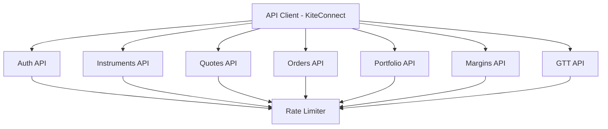
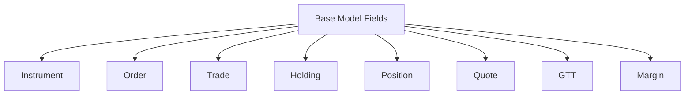

# Technical Design — Zerodha CLI

**Project:** zerodha-cli  
**Version:** 1.0.0  
**Date:** 2026-02-25  
**Author:** ARES (Software Architect)

---

## Section A — Backend Design (Core Library)

### A.1 API Client Specification

#### A.1.1 API Client Module Structure



#### A.1.2 API Client Interface

```rust
// src/api/client.rs

use reqwest::{Client, RequestBuilder};
use serde::{Deserialize, Serialize};
use std::sync::Arc;
use tokio::sync::RwLock;
use anyhow::Result;

/// Kite Connect API client with authentication and rate limiting
pub struct KiteConnectClient {
    /// HTTP client with connection pooling
    http_client: Client,
    /// API credentials
    api_key: String,
    api_secret: String,
    /// Access token (optional before login)
    access_token: Arc<RwLock<Option<String>>>,
    /// Base URL for Kite Connect API
    base_url: String,
    /// Rate limiter (3 req/sec)
    rate_limiter: RateLimiter,
}

impl KiteConnectClient {
    /// Create new API client
    pub fn new(api_key: String, api_secret: String) -> Self;

    /// Set access token after OAuth flow
    pub async fn set_access_token(&self, token: String) -> Result<()>;

    /// Get current access token
    pub async fn get_access_token(&self) -> Result<String>;

    /// Build authenticated request with rate limiting
    async fn request(&self, method: &str, path: &str) -> RequestBuilder;

    /// Execute request with error handling
    async fn execute<T>(&self, req: RequestBuilder) -> Result<T>
    where
        T: for<'de> Deserialize<'de>;

    // Auth API
    pub async fn login_url(&self) -> String;
    pub async fn exchange_token(&self, request_token: &str) -> Result<String>;

    // Instruments API
    pub async fn list_instruments(&self, exchange: Option<&str>) -> Result<Vec<Instrument>>;
    pub async fn get_instrument(&self, exchange: &str, symbol: &str) -> Result<Instrument>;

    // Quotes API
    pub async fn get_quotes(&self, symbols: &[&str]) -> Result<QuotesResponse>;
    pub async fn get_ohlc(&self, symbols: &[&str]) -> Result<OHLCResponse>;
    pub async fn get_ltp(&self, symbols: &[&str]) -> Result<LTPResponse>;

    // Orders API
    pub async fn list_orders(&self) -> Result<Vec<Order>>;
    pub async fn get_order(&self, order_id: &str) -> Result<Order>;
    pub async fn place_order(&self, request: PlaceOrderRequest) -> Result<Order>;
    pub async fn modify_order(&self, order_id: &str, request: ModifyOrderRequest) -> Result<Order>;
    pub async fn cancel_order(&self, order_id: &str, variety: OrderVariety) -> Result<CancelResponse>;
    pub async fn list_trades(&self, order_id: Option<&str>) -> Result<Vec<Trade>>;

    // Portfolio API
    pub async fn get_holdings(&self) -> Result<Vec<Holding>>;
    pub async fn get_positions(&self) -> Result<PositionsResponse>;
    pub async fn convert_position(&self, request: ConvertPositionRequest) -> Result<()>;

    // Margins API
    pub async fn get_margins(&self) -> Result<MarginsResponse>;
    pub async fn get_equity_margins(&self) -> Result<EquityMargins>;
    pub async fn get_commodity_margins(&self) -> Result<CommodityMargins>;

    // GTT API
    pub async fn list_gtt(&self) -> Result<Vec<GTT>>;
    pub async fn get_gtt(&self, trigger_id: &str) -> Result<GTT>;
    pub async fn create_gtt(&self, request: CreateGTTRequest) -> Result<GTT>;
    pub async fn modify_gtt(&self, trigger_id: &str, request: ModifyGTTRequest) -> Result<GTT>;
    pub async fn delete_gtt(&self, trigger_id: &str) -> Result<DeleteResponse>;
}
```

---

### A.2 Domain Models

#### A.2.1 Model Hierarchy



#### A.2.2 Core Data Structures

```rust
// src/models/mod.rs

use serde::{Deserialize, Serialize};
use chrono::{DateTime, Utc};
use std::collections::HashMap;

/// Instrument (trading symbol)
#[derive(Debug, Clone, Serialize, Deserialize)]
pub struct Instrument {
    pub instrument_token: i64,
    pub exchange_token: i64,
    pub tradingsymbol: String,
    pub name: String,
    pub last_price: Option<f64>,
    pub expiry: Option<DateTime<Utc>>,
    pub strike: Option<f64>,
    pub tick_size: f64,
    pub lot_size: i32,
    pub instrument_type: InstrumentType,
    pub segment: Segment,
    pub exchange: Exchange,
}

#[derive(Debug, Clone, Serialize, Deserialize)]
pub enum InstrumentType {
    #[serde(rename = "EQ")]
    Equity,
    #[serde(rename = "CE")]
    CallOption,
    #[serde(rename = "PE")]
    PutOption,
    #[serde(rename = "FUT")]
    Future,
}

#[derive(Debug, Clone, Serialize, Deserialize)]
pub enum Segment {
    #[serde(rename = "NSE")]
    NSE,
    #[serde(rename = "BSE")]
    BSE,
    #[serde(rename = "NFO")]
    NFO,
    #[serde(rename = "BFO")]
    BFO,
    #[serde(rename = "MCX")]
    MCX,
    #[serde(rename = "CDS")]
    CDS,
}

/// Order
#[derive(Debug, Clone, Serialize, Deserialize)]
pub struct Order {
    pub order_id: String,
    pub exchange_order_id: Option<String>,
    pub parent_order_id: Option<String>,
    pub status: OrderStatus,
    pub status_message: Option<String>,
    pub tradingsymbol: String,
    pub exchange: Exchange,
    pub variety: OrderVariety,
    pub order_type: OrderType,
    pub transaction_type: TransactionType,
    pub validity: Validity,
    pub product: Product,
    pub quantity: i32,
    pub disclosed_quantity: Option<i32>,
    pub price: f64,
    pub trigger_price: Option<f64>,
    pub average_price: Option<f64>,
    pub pending_quantity: i32,
    pub filled_quantity: i32,
    pub cancelled_quantity: i32,
    pub placed_by: String,
    pub order_timestamp: DateTime<Utc>,
    pub update_timestamp: Option<DateTime<Utc>>,
}

#[derive(Debug, Clone, Serialize, Deserialize)]
pub enum OrderStatus {
    #[serde(rename = "OPEN")]
    Open,
    #[serde(rename = "COMPLETE")]
    Complete,
    #[serde(rename = "CANCELLED")]
    Cancelled,
    #[serde(rename = "REJECTED")]
    Rejected,
    #[serde(rename = "TRIGGER PENDING")]
    TriggerPending,
    #[serde(rename = "VALIDATION PENDING")]
    ValidationPending,
}

#[derive(Debug, Clone, Serialize, Deserialize)]
pub enum OrderVariety {
    #[serde(rename = "regular")]
    Regular,
    #[serde(rename = "amo")]
    AMO,
    #[serde(rename = "co")]
    CO,
    #[serde(rename = "iceberg")]
    Iceberg,
}

#[derive(Debug, Clone, Serialize, Deserialize)]
pub enum OrderType {
    #[serde(rename = "MARKET")]
    Market,
    #[serde(rename = "LIMIT")]
    Limit,
    #[serde(rename = "SL")]
    StopLoss,
    #[serde(rename = "SL-M")]
    StopLossMarket,
}

#[derive(Debug, Clone, Serialize, Deserialize)]
pub enum TransactionType {
    #[serde(rename = "BUY")]
    Buy,
    #[serde(rename = "SELL")]
    Sell,
}

#[derive(Debug, Clone, Serialize, Deserialize)]
pub enum Validity {
    #[serde(rename = "DAY")]
    Day,
    #[serde(rename = "IOC")]
    IOC,
    #[serde(Debug, Clone, Serialize, Deserialize)]
pub enum Product {
    #[serde(rename = "CNC")]
    CNC,
    #[serde(rename = "MIS")]
    MIS,
    #[serde(rename = "NRML")]
    NRML,
    #[serde(rename = "BO")]
    BO,
}

/// Quote
#[derive(Debug, Clone, Serialize, Deserialize)]
pub struct Quote {
    pub instrument_token: i64,
    pub last_price: f64,
    pub ohlc: OHLC,
    pub depth: Depth,
    pub oi: Option<i64>,
    pub oi_day_highoi: Option<i64>,
    pub oi_day_low: Option<i64>,
    pub timestamp: DateTime<Utc>,
}

#[derive(Debug, Clone, Serialize, Deserialize)]
pub struct OHLC {
    pub open: f64,
    pub high: f64,
    pub low: f64,
    pub close: f64,
}

#[derive(Debug, Clone, Serialize, Deserialize)]
pub struct Depth {
    pub buy: Vec<DepthEntry>,
    pub sell: Vec<DepthEntry>,
}

#[derive(Debug, Clone, Serialize, Deserialize)]
pub struct DepthEntry {
    pub price: f64,
    pub quantity: i32,
    pub orders: i32,
}

/// Holding (long-term equity)
#[derive(Debug, Clone, Serialize, Deserialize)]
pub struct Holding {
    pub instrument_token: i64,
    pub tradingsymbol: String,
    pub exchange: Exchange,
    pub isin: String,
    pub average_price: f64,
    pub last_price: f64,
    pub close_price: f64,
    pub pnl: f64,
    pub day_change: f64,
    pub day_change_percentage: f64,
    pub quantity: i32,
    pub t1_quantity: i32,
    pub realised_quantity: i32,
}

/// Position (intraday/F&O)
#[derive(Debug, Clone, Serialize, Deserialize)]
pub struct Position {
    pub tradingsymbol: String,
    pub exchange: Exchange,
    pub instrument_token: i64,
    pub product: Product,
    pub quantity: i32,
    pub overnight_quantity: i32,
    pub multiplier: i32,
    pub average_price: f64,
    pub close_price: f64,
    pub last_price: f64,
    pub pnl: f64,
    pub m2m: f64,
    pub unrealised: f64,
    pub realised: f64,
    pub buy_quantity: i32,
    pub buy_price: f64,
    pub buy_value: f64,
    pub buy_m2m: f64,
    pub sell_quantity: i32,
    pub sell_price: f64,
    pub sell_value: f64,
    pub sell_m2m: f64,
    pub day_buy_quantity: i32,
    pub day_buy_price: f64,
    pub day_buy_value: f64,
    pub day_sell_quantity: i32,
    pub day_sell_price: f64,
    pub day_sell_value: f64,
}

/// GTT (Good Till Triggered)
#[derive(Debug, Clone, Serialize, Deserialize)]
pub struct GTT {
    pub id: i64,
    pub user_id: String,
    pub created_at: DateTime<Utc>,
    pub updated_at: Option<DateTime<Utc>>,
    pub expiry: Option<DateTime<Utc>>,
    pub condition: GTTCondition,
    pub orders: Vec<GTTOrder>,
    pub status: GTTStatus,
}

#[derive(Debug, Clone, Serialize, Deserialize)]
pub struct GTTCondition {
    pub exchange: Exchange,
    pub tradingsymbol: String,
    pub trigger_values: Vec<f64>,
    pub last_price: f64,
}

#[derive(Debug, Clone, Serialize, Deserialize)]
pub struct GTTOrder {
    pub transaction_type: TransactionType,
    pub product: Product,
    pub order_type: OrderType,
    pub quantity: i32,
    pub price: f64,
    pub validity: Validity,
    pub disclosed_quantity: i32,
}

#[derive(Debug, Clone, Serialize, Deserialize)]
pub enum GTTStatus {
    #[serde(rename = "active")]
    Active,
    #[serde(rename = "triggered")]
    Triggered,
    #[serde(rename = "disabled")]
    Disabled,
    #[serde(rename = "expired")]
    Expired,
    #[serde(rename = "cancelled")]
    Cancelled,
    #[serde(rename = "rejected")]
    Rejected,
}

/// Margin
#[derive(Debug, Clone, Serialize, Deserialize)]
pub struct Margin {
    pub segment: String,
    pub enabled: bool,
    pub net: f64,
    pub available: MarginDetail,
    pub utilised: MarginUtilised,
}

#[derive(Debug, Clone, Serialize, Deserialize)]
pub struct MarginDetail {
    pub cash: f64,
    pub opening_balance: f64,
    pub live_balance: f64,
    pub collateral: f64,
}

#[derive(Debug, Clone, Serialize, Deserialize)]
pub struct MarginUtilised {
    pub debits: f64,
    pub exposure: f64,
    pub options_premium: f64,
    pub payout: f64,
    pub span: f64,
    pub holding_sales: f64,
    pub turnaround: f64,
    pub m2m_unrealised: f64,
    pub m2m_realised: f64,
    pub stock_collateral: f64,
}
```

#### A.2.3 Request/Response Models

```rust
// src/models/requests.rs

use serde::{Deserialize, Serialize};

/// Place order request
#[derive(Debug, Clone, Serialize)]
pub struct PlaceOrderRequest {
    pub tradingsymbol: String,
    pub exchange: Exchange,
    pub transaction_type: TransactionType,
    pub variety: OrderVariety,
    pub order_type: OrderType,
    pub product: Product,
    pub quantity: i32,
    pub price: f64,
    pub trigger_price: Option<f64>,
    pub validity: Validity,
    pub disclosed_quantity: Option<i32>,
}

/// Modify order request
#[derive(Debug, Clone, Serialize)]
pub struct ModifyOrderRequest {
    pub quantity: Option<i32>,
    pub price: Option<f64>,
    pub trigger_price: Option<f64>,
    pub disclosed_quantity: Option<i32>,
    pub validity: Option<Validity>,
}

/// Convert position request
#[derive(Debug, Clone, Serialize)]
pub struct ConvertPositionRequest {
    pub tradingsymbol: String,
    pub exchange: Exchange,
    pub transaction_type: TransactionType,
    pub position_type: Product,
    pub quantity: i32,
    pub old_product: Product,
    pub new_product: Product,
}

/// Create GTT request
#[derive(Debug, Clone, Serialize)]
pub struct CreateGTTRequest {
    pub tradingsymbol: String,
    pub exchange: Exchange,
    pub trigger_type: GTTTriggerType,
    pub trigger_values: Vec<f64>,
    pub last_price: f64,
    pub orders: Vec<GTTOrder>,
}

#[derive(Debug, Clone, Serialize)]
pub enum GTTTriggerType {
    #[serde(rename = "single")]
    Single,
    #[serde(rename = "two-leg")]
    TwoLeg,
}

/// Modify GTT request
#[derive(Debug, Clone, Serialize)]
pub struct ModifyGTTRequest {
    pub trigger_values: Option<Vec<f64>>,
    pub orders: Option<Vec<GTTOrder>>,
}

// src/models/responses.rs

/// Quotes response
#[derive(Debug, Clone, Deserialize)]
pub struct QuotesResponse {
    pub data: HashMap<String, Quote>,
}

/// OHLC response
#[derive(Debug, Clone, Deserialize)]
pub struct OHLCResponse {
    pub data: HashMap<String, OHLC>,
}

/// LTP response
#[derive(Debug, Clone, Deserialize)]
pub struct LTPResponse {
    pub data: HashMap<String, LTPData>,
}

#[derive(Debug, Clone, Deserialize)]
pub struct LTPData {
    pub instrument_token: i64,
    pub last_price: f64,
}

/// Positions response
#[derive(Debug, Clone, Deserialize)]
pub struct PositionsResponse {
    pub day: Vec<Position>,
    pub net: Vec<Position>,
}

/// Margins response
#[derive(Debug, Clone, Deserialize)]
pub struct MarginsResponse {
    pub equity: Margin,
    pub commodity: Margin,
}

/// Cancel response
#[derive(Debug, Clone, Deserialize)]
pub struct CancelResponse {
    pub order_id: String,
}

/// Delete response
#[derive(Debug, Clone, Deserialize)]
pub struct DeleteResponse {
    pub trigger_id: i64,
}
```

---

### A.3 Configuration Management

#### A.3.1 Config Structure

```rust
// src/config/mod.rs

use serde::{Deserialize, Serialize};
use anyhow::{Context, Result};
use std::path::PathBuf;

/// Configuration file structure
#[derive(Debug, Clone, Serialize, Deserialize)]
pub struct Config {
    pub api: ApiConfig,
    #[serde(default)]
    pub defaults: DefaultsConfig,
    #[serde(default)]
    pub output: OutputConfig,
}

#[derive(Debug, Clone, Serialize, Deserialize)]
pub struct ApiConfig {
    pub api_key: String,
    pub api_secret: String,
    #[serde(skip_serializing_if = "Option::is_none")]
    pub access_token: Option<String>,
    #[serde(skip_serializing_if = "Option::is_none")]
    pub token_expiry: Option<String>,
}

#[derive(Debug, Clone, Serialize, Deserialize)]
pub struct DefaultsConfig {
    #[serde(default = "default_exchange")]
    pub exchange: String,
    #[serde(default = "default_product")]
    pub product: String,
    #[serde(default = "default_order_type")]
    pub order_type: String,
    #[serde(default = "default_validity")]
    pub validity: String,
}

#[derive(Debug, Clone, Serialize, Deserialize)]
pub struct OutputConfig {
    #[serde(default = "default_format")]
    pub format: String,
}

impl Default for DefaultsConfig {
    fn default() -> Self {
        Self {
            exchange: default_exchange(),
            product: default_product(),
            order_type: default_order_type(),
            validity: default_validity(),
        }
    }
}

impl Default for OutputConfig {
    fn default() -> Self {
        Self {
            format: default_format(),
        }
    }
}

fn default_exchange() -> String { "NSE".to_string() }
fn default_product() -> String { "CNC".to_string() }
fn default_order_type() -> String { "LIMIT".to_string() }
fn default_validity() -> String { "DAY".to_string() }
fn default_format() -> String { "table".to_string() }

impl Config {
    /// Load config from file or create default
    pub fn load() -> Result<Self> {
        let config_path = Self::config_path()?;

        if config_path.exists() {
            let content = std::fs::read_to_string(&config_path)
                .context("Failed to read config file")?;
            let config: Self = toml::from_str(&content)
                .context("Failed to parse config file")?;
            Ok(config)
        } else {
            // Create default config
            let config = Self::default();
            config.save().context("Failed to create default config")?;
            Ok(config)
        }
    }

    /// Save config to file
    pub fn save(&self) -> Result<()> {
        let config_path = Self::config_path()?;
        let config_dir = config_path.parent()
            .ok_or_else(|| anyhow::anyhow!("Invalid config path"))?;

        std::fs::create_dir_all(config_dir)
            .context("Failed to create config directory")?;

        let content = toml::to_string_pretty(self)
            .context("Failed to serialize config")?;

        std::fs::write(&config_path, content)
            .context("Failed to write config file")?;

        // Set file permissions to 0600 on Unix
        #[cfg(unix)]
        {
            use std::os::unix::fs::PermissionsExt;
            let mut perms = std::fs::metadata(&config_path)?.permissions();
            perms.set_mode(0o600);
            std::fs::set_permissions(&config_path, perms)?;
        }

        Ok(())
    }

    /// Get config file path
    pub fn config_path() -> Result<PathBuf> {
        let config_dir = dirs::config_dir()
            .ok_or_else(|| anyhow::anyhow!("Failed to get config directory"))?;
        Ok(config_dir.join("zerodha-cli").join("config.toml"))
    }

    /// Check if access token is valid (not expired)
    pub fn is_token_valid(&self) -> bool {
        if let Some(expiry_str) = &self.api.token_expiry {
            if let Ok(expiry) = chrono::DateTime::parse_from_rfc3339(expiry_str) {
                return expiry.with_timezone(&chrono::Utc) > chrono::Utc::now();
            }
        }
        false
    }
}
```

---

### A.4 Authentication Flow

#### A.4.1 OAuth Implementation

```rust
// src/auth/mod.rs

use crate::api::KiteConnectClient;
use crate::config::Config;
use anyhow::Result;
use webbrowser;

pub async fn login(api_client: &KiteConnectClient, config: &mut Config) -> Result<String> {
    // 1. Generate login URL
    let login_url = api_client.login_url();

    // 2. Open browser
    webbrowser::open(&login_url)?;

    // 3. Prompt user for request_token
    println!("Browser opened to login page.");
    println!("After completing login, you'll be redirected to a page with a 'request_token' parameter.");
    print!("Enter the request_token: ");

    // 4. Read request_token from stdin
    let mut request_token = String::new();
    std::io::stdin().read_line(&mut request_token)?;
    let request_token = request_token.trim();

    // 5. Exchange for access_token
    let access_token = api_client.exchange_token(request_token).await?;

    // 6. Save to config
    config.api.access_token = Some(access_token.clone());
    let expiry = chrono::Utc::now() + chrono::Duration::days(1); // Kite tokens expire in 1 day
    config.api.token_expiry = Some(expiry.to_rfc3339());
    config.save()?;

    // 7. Set in API client
    api_client.set_access_token(access_token.clone()).await?;

    Ok(access_token)
}

pub fn logout(config: &mut Config) -> Result<()> {
    config.api.access_token = None;
    config.api.token_expiry = None;
    config.save()?;
    Ok(())
}

pub fn status(config: &Config) -> AuthStatus {
    if let Some(token) = &config.api.access_token {
        if config.is_token_valid() {
            AuthStatus::Authenticated { expiry: config.api.token_expiry.clone() }
        } else {
            AuthStatus::TokenExpired
        }
    } else {
        AuthStatus::NotAuthenticated
    }
}

pub enum AuthStatus {
    NotAuthenticated,
    Authenticated { expiry: Option<String> },
    TokenExpired,
}
```

---

### A.5 Instrument Cache

#### A.5.1 Cache Implementation

```rust
// src/cache/mod.rs

use crate::models::Instrument;
use anyhow::{Context, Result};
use std::path::PathBuf;
use csv::Reader;

pub struct InstrumentCache;

impl InstrumentCache {
    /// Get cache directory
    pub fn cache_dir() -> Result<PathBuf> {
        let cache_dir = dirs::cache_dir()
            .ok_or_else(|| anyhow::anyhow!("Failed to get cache directory"))?;
        let dir = cache_dir.join("zerodha-cli").join("instruments");
        std::fs::create_dir_all(&dir)?;
        Ok(dir)
    }

    /// Get cache file path for exchange
    pub fn cache_file(exchange: &str) -> Result<PathBuf> {
        Ok(Self::cache_dir()?.join(format!("{}_{}.csv", exchange, chrono::Utc::now().format("%Y-%m-%d"))))
    }

    /// Check if cache is valid (not expired)
    pub fn is_valid(exchange: &str) -> Result<bool> {
        let cache_file = Self::cache_file(exchange)?;

        if !cache_file.exists() {
            return Ok(false);
        }

        // Check modification time (max 24h)
        let metadata = std::fs::metadata(&cache_file)?;
        let modified = metadata.modified()?;
        let age = chrono::Utc::now()
            .signed_duration_since(chrono::DateTime::<chrono::Utc>::from(modified));

        Ok(age.num_hours() < 24)
    }

    /// Load instruments from cache
    pub fn load(exchange: &str) -> Result<Vec<Instrument>> {
        let cache_file = Self::cache_file(exchange)?;

        let mut rdr = Reader::from_path(&cache_file)?;
        let mut instruments = Vec::new();

        for result in rdr.deserialize() {
            let instrument: Instrument = result?;
            instruments.push(instrument);
        }

        Ok(instruments)
    }

    /// Save instruments to cache
    pub fn save(exchange: &str, instruments: &[Instrument]) -> Result<()> {
        let cache_file = Self::cache_file(exchange)?;

        let mut wtr = csv::Writer::from_path(&cache_file)?;

        for instrument in instruments {
            wtr.serialize(instrument)?;
        }

        wtr.flush()?;
        Ok(())
    }
}
```

---

### A.6 Business Logic & Validation

#### A.6.1 Order Validation

```rust
// src/validation/mod.rs

use crate::models::{OrderType, Product, Validity, TransactionType};
use anyhow::{bail, Result};

pub fn validate_order(
    order_type: OrderType,
    quantity: i32,
    price: f64,
    trigger_price: Option<f64>,
    product: Product,
) -> Result<()> {
    // Quantity must be positive
    if quantity <= 0 {
        bail!("Quantity must be greater than 0");
    }

    // Price must be positive
    if price <= 0.0 {
        bail!("Price must be greater than 0");
    }

    // Validate order type and required fields
    match order_type {
        OrderType::Market => {
            // Market orders don't need price or trigger_price
        }
        OrderType::Limit => {
            // Limit orders need price
            if price <= 0.0 {
                bail!("Limit orders require a valid price");
            }
        }
        OrderType::StopLoss => {
            // SL orders need both price and trigger_price
            if trigger_price.is_none() {
                bail!("Stop Loss orders require a trigger price");
            }
            if let Some(tp) = trigger_price {
                if tp <= 0.0 {
                    bail!("Trigger price must be greater than 0");
                }
            }
        }
        OrderType::StopLossMarket => {
            // SL-M orders need trigger_price
            if trigger_price.is_none() {
                bail!("Stop Loss Market orders require a trigger price");
            }
            if let Some(tp) = trigger_price {
                if tp <= 0.0 {
                    bail!("Trigger price must be greater than 0");
                }
            }
        }
    }

    // Validate product type
    match product {
        Product::CNC | Product::NRML | Product::MIS | Product::BO => {}
    }

    Ok(())
}

pub fn validate_symbol(symbol: &str) -> Result<(String, String)> {
    let parts: Vec<&str> = symbol.split(':').collect();
    if parts.len() != 2 {
        bail!("Invalid symbol format. Expected: EXCHANGE:SYMBOL (e.g., NSE:INFY)");
    }
    let exchange = parts[0].to_uppercase();
    let tradingsymbol = parts[1].to_uppercase();

    // Validate exchange
    match exchange.as_str() {
        "NSE" | "BSE" | "NFO" | "BFO" | "MCX" | "CDS" => {}
        _ => bail!("Invalid exchange. Valid exchanges: NSE, BSE, NFO, BFO, MCX, CDS"),
    }

    Ok((exchange, tradingsymbol))
}
```

---

### A.7 Error Handling

#### A.7.1 Error Types

```rust
// src/error/mod.rs

use thiserror::Error;

#[derive(Error, Debug)]
pub enum ZerodhaError {
    #[error("API error: {message}")]
    Api { status: u16, message: String },

    #[error("Network error: {0}")]
    Network(#[from] reqwest::Error),

    #[error("IO error: {0}")]
    IO(#[from] std::io::Error),

    #[error("Config error: {0}")]
    Config(String),

    #[error("Authentication error: {0}")]
    Auth(String),

    #[error("Validation error: {0}")]
    Validation(String),

    #[error("Cache error: {0}")]
    Cache(String),

    #[error("Rate limit exceeded")]
    RateLimit,

    #[error("Parse error: {0}")]
    Parse(String),
}

impl ZerodhaError {
    pub fn api(status: u16, message: impl Into<String>) -> Self {
        Self::Api {
            status,
            message: message.into(),
        }
    }

    pub fn config(message: impl Into<String>) -> Self {
        Self::Config(message.into())
    }

    pub fn auth(message: impl Into<String>) -> Self {
        Self::Auth(message.into())
    }

    pub fn validation(message: impl Into<String>) -> Self {
        Self::Validation(message.into())
    }

    pub fn parse(message: impl Into<String>) -> Self {
        Self::Parse(message.into())
    }
}
```

---

## Section B — Frontend Design (CLI Interface)

### B.1 CLI Structure

#### B.1.1 Command Hierarchy

```mermaid
graph TD
    CLI[kite]
    AUTH[auth]
    INSTRUMENTS[instruments]
    QUOTES[quotes]
    ORDERS[orders]
    PORTFOLIO[portfolio]
    MARGINS[margins]
    GTT[gtt]
    SHELL[shell]
    STATUS[status]

    CLI --> AUTH
    CLI --> INSTRUMENTS
    CLI --> QUOTES
    CLI --> ORDERS
    CLI --> PORTFOLIO
    CLI --> MARGINS
    CLI --> GTT
    CLI --> SHELL
    CLI --> STATUS

    AUTH --> AUTH_LOGIN[login]
    AUTH --> AUTH_STATUS[status]
    AUTH --> AUTH_LOGOUT[logout]
    AUTH --> AUTH_SETUP[setup]

    INSTRUMENTS --> INST_LIST[list]
    INSTRUMENTS --> INST_SEARCH[search]
    INSTRUMENTS --> INST_GET[get]

    QUOTES --> QUOTE_GET[get]
    QUOTES --> QUOTE_OHLC[ohlc]
    QUOTES --> QUOTE_LTP[ltp]

    ORDERS --> ORD_LIST[list]
    ORDERS --> ORD_GET[get]
    ORDERS --> ORD_PLACE[place]
    ORDERS --> ORD_MARKET[market]
    ORDERS --> ORD_MODIFY[modify]
    ORDERS --> ORD_CANCEL[cancel]
    ORDERS --> ORD_CANCEL_ALL[cancel-all]
    ORDERS --> ORD_TRADES[trades]

    PORTFOLIO --> PORT_HOLDINGS[holdings]
    PORTFOLIO --> PORT_POSITIONS[positions]
    PORTFOLIO --> PORT_CONVERT[convert]

    MARGINS --> MARG_LIST[list]
    MARGINS --> MARG_EQUITY[equity]
    MARGINS --> MARG_COMMODITY[commodity]

    GTT --> GTT_LIST[list]
    GTT --> GTT_GET[get]
    GTT --> GTT_CREATE[create]
    GTT --> GTT_MODIFY[modify]
    GTT --> GTT_DELETE[delete]
```



---

### B.2 Command Definitions (clap Derive)

#### B.2.1 Main CLI

```rust
// src/cli/mod.rs

use clap::{Parser, Subcommand};
use anyhow::Result;

#[derive(Parser)]
#[command(name = "kite")]
#[command(about = "Zerodha Kite Connect CLI", long_about = None)]
#[command(version = "1.0.0")]
pub struct Cli {
    /// Output format (table, json)
    #[arg(short, long, global = true, default_value = "table")]
    pub output: String,

    /// Config file path
    #[arg(short, long, global = true)]
    pub config: Option<String>,

    /// Verbose output
    #[arg(short, long, global = true)]
    pub verbose: bool,

    #[command(subcommand)]
    pub command: Commands,
}

#[derive(Subcommand)]
pub enum Commands {
    /// Authentication management
    Auth(AuthCommands),

    /// Browse and search instruments
    Instruments(InstrumentsCommands),

    /// Market data and quotes
    Quotes(QuotesCommands),

    /// Order management
    Orders(OrdersCommands),

    /// Holdings and positions
    Portfolio(PortfolioCommands),

    /// Margin and funds information
    Margins(MarginsCommands),

    /// Good Till Triggered orders
    Gtt(GttCommands),

    /// Show system status
    Status,

    /// Interactive REPL mode
    Shell,
}

// Auth Commands
#[derive(Subcommand)]
pub enum AuthCommands {
    /// Authenticate with Zerodha (OAuth flow)
    Login,

    /// Show authentication status
    Status,

    /// Logout and invalidate session
    Logout,

    /// Configure API credentials
    Setup {
        /// API key
        #[arg(long)]
        api_key: String,

        /// API secret
        #[arg(long)]
        api_secret: String,
    },
}

// Instruments Commands
#[derive(Subcommand)]
pub enum InstrumentsCommands {
    /// List all instruments from exchange
    List {
        /// Exchange (NSE, BSE, NFO, BFO, MCX, CDS)
        #[arg(short, long)]
        exchange: Option<String>,

        /// Refresh cache (re-download instruments)
        #[arg(short, long)]
        refresh: bool,
    },

    /// Search for instrument by symbol or name
    Search {
        /// Search query (symbol or name)
        query: String,

        /// Exchange filter
        #[arg(short, long)]
        exchange: Option<String>,
    },

    /// Get detailed info for specific instrument
    Get {
        /// Instrument symbol (e.g., NSE:INFY)
        symbol: String,
    },
}

// Quotes Commands
#[derive(Subcommand)]
pub enum QuotesCommands {
    /// Get full quote for one or more instruments
    Get {
        /// Instrument symbols (e.g., NSE:INFY NSE:TCS)
        symbols: Vec<String>,
    },

    /// Get OHLC data only
    Ohlc {
        /// Instrument symbols
        symbols: Vec<String>,
    },

    /// Get last traded price only
    Ltp {
        /// Instrument symbols
        symbols: Vec<String>,
    },
}

// Orders Commands
#[derive(Subcommand)]
pub enum OrdersCommands {
    /// List all orders
    List {
        /// Filter by status
        #[arg(short, long)]
        status: Option<String>,
    },

    /// Get details for specific order
    Get {
        /// Order ID
        order_id: String,
    },

    /// Place a limit order
    Place {
        /// Instrument symbol (e.g., NSE:INFY)
        #[arg(short, long)]
        symbol: String,

        /// Order type (BUY, SELL)
        #[arg(short, long)]
        order_type: String,

        /// Order type (MARKET, LIMIT, SL, SL-M)
        #[arg(long)]
        order_type_enum: Option<String>,

        /// Quantity
        #[arg(short, long)]
        quantity: i32,

        /// Price (for LIMIT orders)
        #[arg(short, long)]
        price: f64,

        /// Product type (CNC, MIS, NRML)
        #[arg(short, long)]
        product: Option<String>,

        /// Validity (DAY, IOC)
        #[arg(short, long)]
        validity: Option<String>,

        /// Dry-run mode (don't actually place order)
        #[arg(long)]
        dry_run: bool,

        /// Variety (regular, amo, co, iceberg)
        #[arg(long, default_value = "regular")]
        variety: String,
    },

    /// Place a market order
    Market {
        /// Instrument symbol
        #[arg(short, long)]
        symbol: String,

        /// Transaction type (BUY, SELL)
        #[arg(short, long)]
        order_type: String,

        /// Quantity
        #[arg(short, long)]
        quantity: i32,

        /// Product type
        #[arg(short, long)]
        product: Option<String>,

        /// Dry-run mode
        #[arg(long)]
        dry_run: bool,
    },

    /// Modify an existing order
    Modify {
        /// Order ID
        order_id: String,

        /// New price
        #[arg(short, long)]
        price: Option<f64>,

        /// New quantity
        #[arg(short, long)]
        quantity: Option<i32>,

        /// New trigger price (for SL orders)
        #[arg(long)]
        trigger_price: Option<f64>,

        /// New validity
        #[arg(short, long)]
        validity: Option<String>,

        /// New disclosed quantity
        #[arg(long)]
        disclosed_quantity: Option<i32>,
    },

    /// Cancel an order
    Cancel {
        /// Order ID
        order_id: String,

        /// Variety (regular, amo, co, iceberg)
        #[arg(long, default_value = "regular")]
        variety: String,
    },

    /// Cancel all open orders
    CancelAll,

    /// View trade history
    Trades {
        /// Order ID (optional)
        order_id: Option<String>,
    },
}

// Portfolio Commands
#[derive(Subcommand)]
pub enum PortfolioCommands {
    /// View holdings (long-term equity)
    Holdings,

    /// View positions (intraday/F&O)
    Positions {
        /// Show net positions (default)
        #[arg(long)]
        net: bool,

        /// Show day positions only
        #[arg(long)]
        day: bool,
    },

    /// Convert position type
    Convert {
        /// Instrument symbol
        #[arg(short, long)]
        symbol: String,

        /// Transaction type (BUY, SELL)
        #[arg(short, long)]
        order_type: String,

        /// Quantity
        #[arg(short, long)]
        quantity: i32,

        /// From product type
        #[arg(long)]
        from: String,

        /// To product type
        #[arg(long)]
        to: String,
    },
}

// Margins Commands
#[derive(Subcommand)]
pub enum MarginsCommands {
    /// View all margin segments
    List,

    /// View equity margins
    Equity,

    /// View commodity margins
    Commodity,
}

// GTT Commands
#[derive(Subcommand)]
pub enum GttCommands {
    /// List all GTT orders
    List,

    /// Get details for specific GTT
    Get {
        /// Trigger ID
        trigger_id: String,
    },

    /// Create a GTT order
    Create {
        /// Instrument symbol
        #[arg(short, long)]
        symbol: String,

        /// Transaction type (BUY, SELL)
        #[arg(short, long)]
        order_type: String,

        /// Quantity
        #[arg(short, long)]
        quantity: i32,

        /// Order price
        #[arg(short, long)]
        price: f64,

        /// Trigger price
        #[arg(short, long)]
        trigger_price: f64,

        /// Trigger type (single, two-leg)
        #[arg(long)]
        trigger_type: String,

        /// Order type (MARKET, LIMIT)
        #[arg(long)]
        order_type_enum: Option<String>,

        /// Product type
        #[arg(short, long)]
        product: Option<String>,
    },

    /// Modify an existing GTT
    Modify {
        /// Trigger ID
        trigger_id: String,

        /// New order price
        #[arg(short, long)]
        price: Option<f64>,

        /// New trigger price
        #[arg(short, long)]
        trigger_price: Option<f64>,
    },

    /// Delete a GTT order
    Delete {
        /// Trigger ID
        trigger_id: String,
    },
}

pub async fn run_cli() -> Result<()> {
    let cli = Cli::parse();

    // Load config
    let mut config = match cli.config.as_deref() {
        Some(path) => {
            let content = std::fs::read_to_string(path)?;
            toml::from_str(&content)?
        }
        None => Config::load()?,
    };

    // Create API client
    let api_client = KiteConnectClient::new(
        config.api.api_key.clone(),
        config.api.api_secret.clone(),
    );

    // Set access token if available
    if let Some(ref token) = config.api.access_token {
        api_client.set_access_token(token.clone()).await?;
    }

    // Execute command
    match cli.command {
        Commands::Auth(cmd) => auth::run(cmd, &api_client, &mut config).await?,
        Commands::Instruments(cmd) => instruments::run(cmd, &api_client, cli.output).await?,
        Commands::Quotes(cmd) => quotes::run(cmd, &api_client, cli.output).await?,
        Commands::Orders(cmd) => orders::run(cmd, &api_client, cli.output).await?,
        Commands::Portfolio(cmd) => portfolio::run(cmd, &api_client, cli.output).await?,
        Commands::Margins(cmd) => margins::run(cmd, &api_client, cli.output).await?,
        Commands::Gtt(cmd) => gtt::run(cmd, &api_client, cli.output).await?,
        Commands::Status => status::run(&config, &api_client).await?,
        Commands::Shell => shell::run(&config, &api_client).await?,
    }

    Ok(())
}
```

---

### B.3 Output Formatting

#### B.3.1 Table Formatting (comfy-table)

```rust
// src/output/mod.rs

use crate::models::{Holding, Order, Margin};
use comfy_table::{Table, Cell, Color, Attribute, ContentArrangement};
use serde::Serialize;

pub trait OutputFormatter {
    fn print(&self) -> anyhow::Result<()>;
    fn print_json(&self) -> anyhow::Result<()>;
}

impl OutputFormatter for Vec<Holding> {
    fn print(&self) -> anyhow::Result<()> {
        let mut table = Table::new();
        table.set_header(vec![
            "Symbol", "Qty", "Avg Price", "LTP", "P&L", "Day Chg%"
        ]);

        for holding in self {
            let pnl_cell = if holding.pnl >= 0.0 {
                Cell::new(format!("₹{:.2}", holding.pnl))
                    .fg(Color::Green)
                    .add_attribute(Attribute::Bold)
            } else {
                Cell::new(format!("₹{:.2}", holding.pnl))
                    .fg(Color::Red)
                    .add_attribute(Attribute::Bold)
            };

            let chg_cell = if holding.day_change_percentage >= 0.0 {
                Cell::new(format!("{:.2}%", holding.day_change_percentage))
                    .fg(Color::Green)
            } else {
                Cell::new(format!("{:.2}%", holding.day_change_percentage))
                    .fg(Color::Red)
            };

            table.add_row(vec![
                Cell::new(&holding.tradingsymbol),
                Cell::new(holding.quantity.to_string()),
                Cell::new(format!("₹{:.2}", holding.average_price)),
                Cell::new(format!("₹{:.2}", holding.last_price)),
                pnl_cell,
                chg_cell,
            ]);
        }

        table.set_content_arrangement(ContentArrangement::Dynamic);
        println!("{table}");
        Ok(())
    }

    fn print_json(&self) -> anyhow::Result<()> {
        println!("{}", serde_json::to_string_pretty(self)?);
        Ok(())
    }
}

impl OutputFormatter for Vec<Order> {
    fn print(&self) -> anyhow::Result<()> {
        let mut table = Table::new();
        table.set_header(vec![
            "Order ID", "Symbol", "Type", "Qty", "Price", "Status", "Time"
        ]);

        for order in self {
            let status_cell = match order.status {
                crate::models::OrderStatus::Complete => Cell::new("COMPLETE")
                    .fg(Color::Green),
                crate::models::OrderStatus::Open => Cell::new("OPEN")
                    .fg(Color::Yellow),
                crate::models::OrderStatus::Cancelled => Cell::new("CANCELLED")
                    .fg(Color::Red),
                crate::models::OrderStatus::Rejected => Cell::new("REJECTED")
                    .fg(Color::Red),
                _ => Cell::new(format!("{:?}", order.status)),
            };

            table.add_row(vec![
                Cell::new(&order.order_id),
                Cell::new(&order.tradingsymbol),
                Cell::new(format!("{:?}", order.transaction_type)),
                Cell::new(order.quantity.to_string()),
                Cell::new(format!("₹{:.2}", order.price)),
                status_cell,
                Cell::new(order.order_timestamp.format("%Y-%m-%d %H:%M").to_string()),
            ]);
        }

        table.set_content_arrangement(ContentArrangement::Dynamic);
        println!("{table}");
        Ok(())
    }

    fn print_json(&self) -> anyhow::Result<()> {
        println!("{}", serde_json::to_string_pretty(self)?);
        Ok(())
    }
}
```

---

### B.4 Interactive Shell

#### B.4.1 REPL Implementation

```rust
// src/shell/mod.rs

use rustyline::{Editor, CompletionType, Config};
use rustyline::completion::{FilenameCompleter, Pair};
use rustyline::history::DefaultHistory;
use anyhow::Result;

pub async fn run(config: &Config, api_client: &KiteConnectClient) -> Result<()> {
    let rl_config = Config::builder()
        .history_ignore_space(true)
        .completion_type(CompletionType::List)
        .build();

    let mut rl = Editor::<(), DefaultHistory>::with_config(rl_config)?;

    let history_path = shell_history_path()?;
    if history_path.exists() {
        rl.load_history(&history_path)?;
    }

    println!("Zerodha CLI Shell v1.0.0");
    println!("Type 'help' for commands, 'exit' to quit.\n");

    loop {
        let readline = rl.readline("kite> ");
        match readline {
            Ok(line) => {
                rl.add_history_entry(&line)?;

                let line = line.trim();

                if line.is_empty() {
                    continue;
                }

                if line == "exit" || line == "quit" {
                    println!("Goodbye!");
                    break;
                }

                if line == "help" {
                    print_help();
                    continue;
                }

                // Execute command (strip 'kite' prefix if present)
                let cmd = line.strip_prefix("kite ").unwrap_or(line);
                execute_shell_command(cmd, config, api_client).await?;
            }
            Err(rustyline::error::ReadlineError::Interrupted) => {
                println!("Use Ctrl+D to exit.");
            }
            Err(rustyline::error::ReadlineError::Eof) => {
                println!("Goodbye!");
                break;
            }
            Err(e) => {
                eprintln!("Error: {e}");
            }
        }
    }

    rl.save_history(&history_path)?;
    Ok(())
}

fn shell_history_path() -> Result<std::path::PathBuf> {
    let data_dir = dirs::data_local_dir()
        .ok_or_else(|| anyhow::anyhow!("Failed to get data directory"))?;
    Ok(data_dir.join("zerodha-cli").join("history"))
}

fn print_help() {
    println!("Available commands:");
    println!("  auth [login|status|logout]     Authentication");
    println!("  instruments [list|search]      Browse instruments");
    println!("  quotes [get|ohlc|ltp]         Market data");
    println!("  orders [list|place|cancel]    Order management");
    println!("  portfolio [holdings|positions] Portfolio");
    println!("  margins [list|equity]         Margins");
    println!("  gtt [list|create|delete]       GTT orders");
    println!("  status                        System status");
    println!("  exit                          Quit shell");
}

async fn execute_shell_command(
    cmd: &str,
    config: &Config,
    api_client: &KiteConnectClient,
) -> Result<()> {
    // Parse and execute command (re-use CLI parsing logic)
    // This would call the same handler functions as the main CLI
    // but with the 'kite' prefix stripped

    println!("Executing: {}", cmd);
    // TODO: Implement command parsing and execution
    Ok(())
}
```

---

## B.5 State Management Strategy

Since this is a CLI tool (not a web app with React/Vue state), "state management" refers to:

| State | Storage | Scope | Persistence |
|-------|---------|-------|-------------|
| **Config** | TOML file | Global | Persistent |
| **Access Token** | Config + API client | Session | Persistent (1-day expiry) |
| **Instrument Cache** | CSV files | Global | Persistent (24h TTL) |
| **Shell History** | History file | Session | Persistent (1000 lines) |
| **Rate Limiter** | In-memory | API client | Session |

---

## B.6 API Integration Patterns

### B.6.1 Command Handler Pattern

```rust
// src/commands/mod.rs

use crate::cli::*;
use crate::api::KiteConnectClient;
use crate::config::Config;
use anyhow::Result;

pub mod auth;
pub mod instruments;
pub mod quotes;
pub mod orders;
pub mod portfolio;
pub mod margins;
pub mod gtt;
pub mod status;
pub mod shell;

// Example: orders handler
pub async fn handle_orders_list(
    status_filter: Option<String>,
    api_client: &KiteConnectClient,
    output_format: &str,
) -> Result<()> {
    let orders = api_client.list_orders().await?;

    let filtered = if let Some(status) = status_filter {
        orders.into_iter()
            .filter(|o| format!("{:?}", o.status).to_lowercase() == status.to_lowercase())
            .collect()
    } else {
        orders
    };

    if output_format == "json" {
        filtered.print_json()?;
    } else {
        filtered.print()?;
    }

    Ok(())
}
```

---

## Technical Design Summary

This technical design document provides:

- **Section A (Backend/Core)**: Complete API client, domain models, config management, authentication, caching, validation, and error handling for the core library
- **Section B (Frontend/CLI)**: Full CLI command structure, clap definitions, output formatting, and interactive shell implementation

The design maintains clean separation between:
- **Core library** (`zerodha-cli-core`) — Business logic, API client, models
- **CLI binary** (`zerodha-cli`) — Command parsing, user interaction, output formatting

All modules are designed for testability, extensibility, and ergonomics.

---

**End of Technical Design Document**
